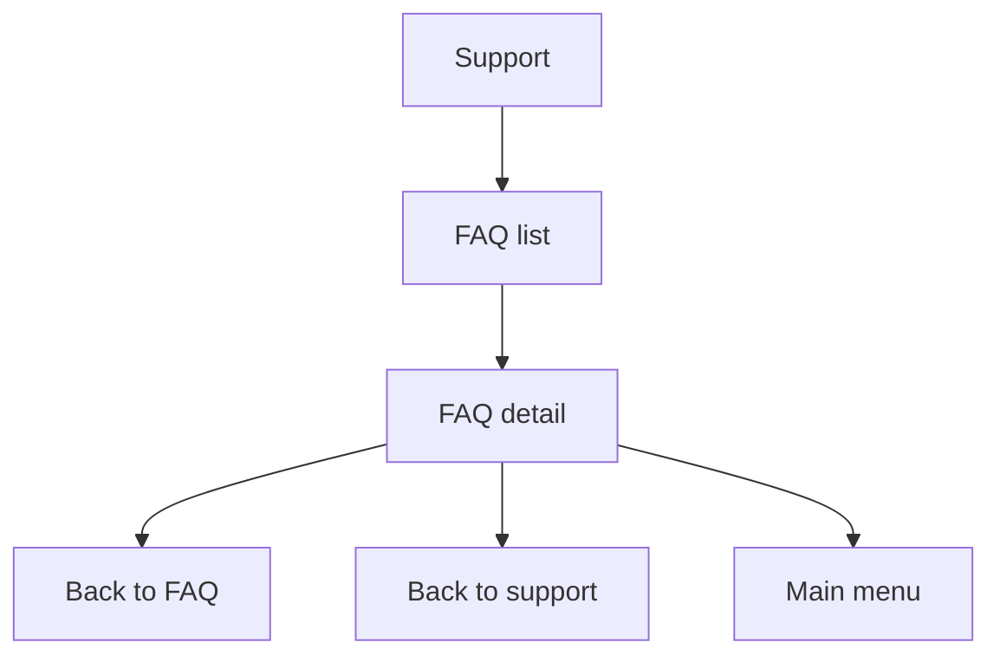

# Telegram FAQ

FAQ content is configured under `app.telegram.faq`.

Each item has:

- Stable non-secret `id`.
- `enabled` flag.
- `displayOrder`.
- Question and answer text.
- Optional bounded keywords.

The FAQ list shows enabled items only and sorts by display order, then ID. Detail callbacks carry only the stable FAQ ID and page number. Answers are HTML-escaped before rendering.

