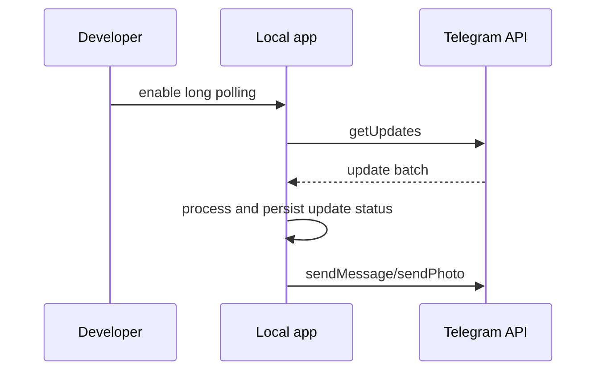

# Telegram Local Development

1. Create a test bot with BotFather.
2. Configure only test credentials:

```env
TELEGRAM_BOT_ENABLED=true
TELEGRAM_BOT_TOKEN=123456:fake-test-token
TELEGRAM_BOT_USERNAME=FakePanelBot
TELEGRAM_BOT_UPDATE_MODE=LONG_POLLING
TELEGRAM_BOT_CALLBACK_SIGNING_SECRET=replace-with-a-long-random-test-secret
```

3. Start the application with PostgreSQL available.
4. Send `/start` to the bot from a private test chat.

Long polling is disabled by default. When enabled, the worker stores its offset in PostgreSQL and processes updates sequentially.

Do not use production bot tokens, production users, production subscriptions, or production inbounds during local testing.


