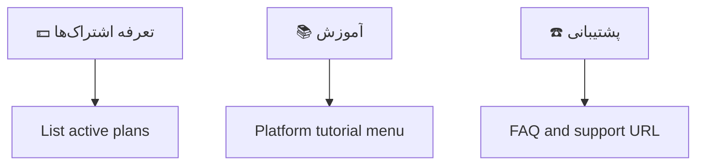

# Telegram Main Menu

The customer-facing Telegram bot uses a persistent Persian `ReplyKeyboardMarkup` for global navigation.

```text
[ 🔐 خرید اشتراک ] [ ♻️ تمدید سرویس ]
[ 🛍 سرویس‌های من ] [ 🔑 اکانت تست ]
[ 💵 تعرفه اشتراک‌ها ] [ 💰 کیف پول + شارژ ]
[ 📚 آموزش ]
[ ☎️ پشتیبانی ]
```

Visible text is resolved through localization keys. Handlers use `TelegramMainMenuAction`, not raw Persian text.

Reply keyboard policy:

- Use reply keyboard only for persistent global navigation.
- Use inline keyboard for page actions, service details, config delivery actions, Back, and Home.
- Do not place sensitive one-time confirmations in the persistent keyboard.

Feature behavior:

- Buy routes to the existing purchase entry point.
- Tariffs route to a read-only active plan tariff catalog.
- My services routes to the Task 43 customer service list with pagination, quick search, account summary access, and safe service details.
- Account summary is available through `/account`, `/profile`, and the My Services page without adding another permanent main-menu row.
- Tutorials route to configured platform instructions and trusted download links.
- Support routes to FAQ and configured Telegram support URL.
- Renewal opens the Task 45 renewal service flow when `app.sales.renewal-enabled=true`.
- Trial and wallet remain visible but return localized unavailable messages until those domains are implemented.

```mermaid
flowchart TD
    Start[/start] --> Welcome[Welcome message]
    Welcome --> ReplyKeyboard[Persistent reply keyboard]
    ReplyKeyboard --> Text[Exact menu text]
    Text --> Action[TelegramMainMenuAction]
    Action --> Enabled{Enabled?}
    Enabled -->|yes| Route[Route to existing handler]
    Enabled -->|no| Placeholder[Localized unavailable message]
```


## Task 44 Purchase Entry

The persistent `🔐 خرید اشتراک` button now opens the selectable purchase catalog.

If new purchases are disabled by `app.sales.new-purchase-enabled=false`, the button remains visible but returns a safe localized disabled-sales message. No `PlanSelection`, `Order`, `Payment`, or Telegram purchase session is created in that state.

## Task 45 Renewal Entry

The persistent `♻️ تمدید سرویس` button lists renewable services owned by the Telegram user. When renewal sales are disabled, the button remains visible but returns a safe localized unavailable message and creates no session, selection, order, or payment.
