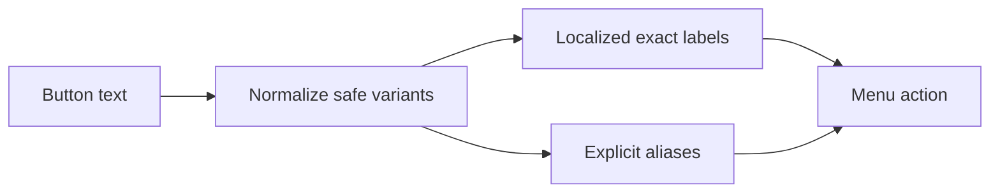

# Telegram Menu Localization

Main menu labels are centralized in the Telegram message catalog:

- `telegram.main.buy_subscription`
- `telegram.main.renew_service`
- `telegram.main.my_services`
- `telegram.main.trial_account`
- `telegram.main.tariffs`
- `telegram.main.wallet`
- `telegram.main.tutorials`
- `telegram.main.support`

Navigation labels:

- `telegram.navigation.back`
- `telegram.navigation.home`
- `telegram.navigation.close`

Text routing uses exact normalized matches only. The normalizer handles Arabic/Persian `ي/ی`, `ك/ک`, extra whitespace, zero-width joiners/non-joiners, and emoji variation selectors. It does not use fuzzy matching.

Explicit aliases support previously deployed labels such as `🛒 Buy VPN`, `📦 My subscriptions`, and older Persian variants.

Fallback locale is English when a Telegram language is missing or unsupported.

