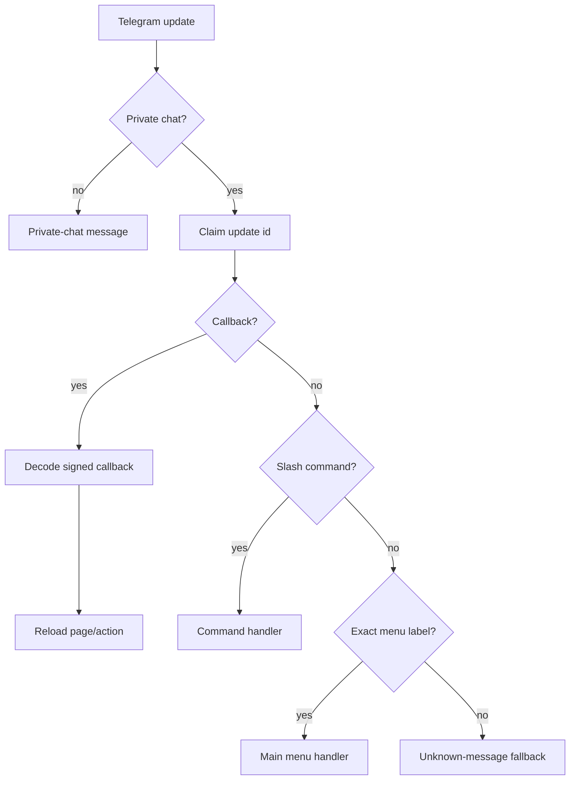
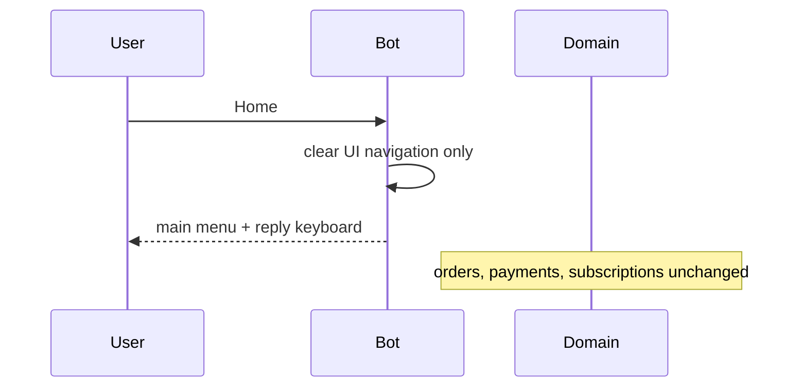

# Telegram Navigation

Routing priority:

1. Private-chat validation.
2. Processed-update idempotency claim.
3. Callback query handling.
4. Slash command handling.
5. Exact main-menu text routing.
6. Generic unknown-message fallback.
7. Unsupported update ignore.

Home sends a new main-menu message and restores the persistent reply keyboard. It does not cancel orders, payments, subscriptions, sensitive actions, or plan selections.

Back uses explicit signed callback actions and reloads server-side resources. Callback data remains signed, user-bound, and time-bounded.

Close is modeled as `TelegramNavigationAction.CLOSE`; it is reserved for pages where removing inline controls is safe.

