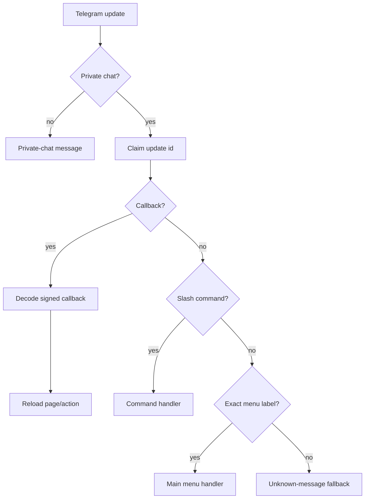
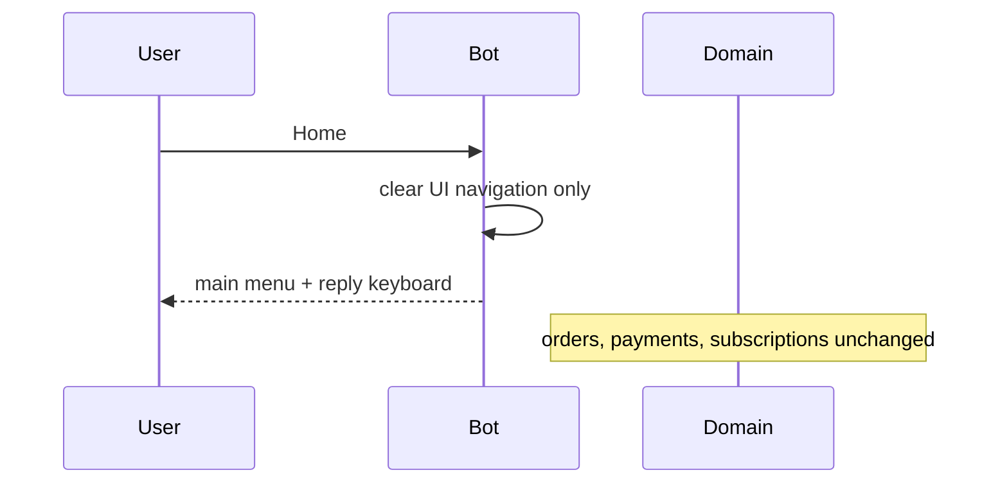
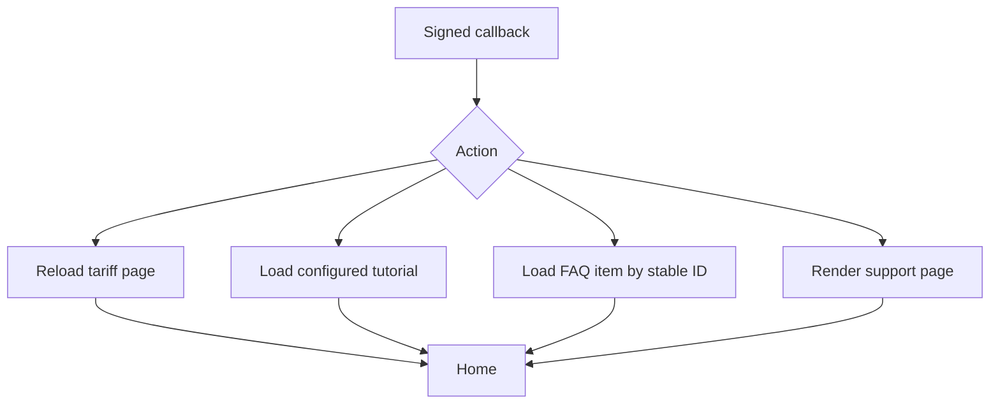

# Telegram Navigation

Routing priority:

1. Private-chat validation.
2. Processed-update idempotency claim.
3. Callback query handling.
4. Slash command handling.
5. Active My Services search conversation.
6. Exact main-menu text routing.
7. Generic unknown-message fallback.
8. Unsupported update ignore.

Home sends a new main-menu message and restores the persistent reply keyboard. It does not cancel orders, payments, subscriptions, sensitive actions, or plan selections.

Back uses explicit signed callback actions and reloads server-side resources. Callback data remains signed, user-bound, and time-bounded.

Close is modeled as `TelegramNavigationAction.CLOSE`; it is reserved for pages where removing inline controls is safe.

Task 42 page routing:

- Tariffs: `Main menu -> Tariffs -> Buy subscription | Home`.
- Tutorials: `Main menu -> Tutorials -> Platform detail -> Back to tutorials | Home`.
- FAQ: `Support -> FAQ list -> FAQ detail -> Back to FAQ -> Back to Support | Home`.
- Support: `Main menu -> Support -> FAQ | t.me URL | Home`.

Task 43 customer routing:

- Account: `/account -> account summary -> My Services | Payments | Settings | Home`.
- My Services: `Main menu -> My Services -> page -> service detail | quick search | account | Home`.
- Search: `My Services -> Quick search -> owned result buttons -> service detail`.
- Service detail: `Service detail -> config/link/QR/refresh/tutorials/renewal placeholder | Back | Home`.

`/menu` and `/cancel` clear only the short-lived service-search UI state. They do not cancel Orders, Payments, Subscriptions, token rotation records, or provisioning state.

