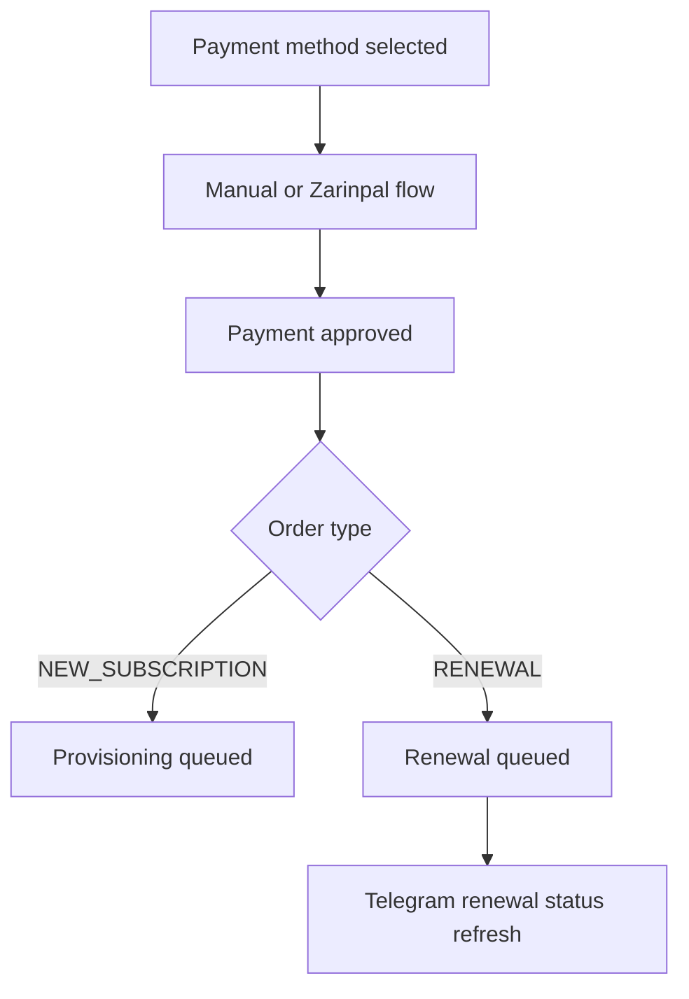

# Telegram Payment Flow

Telegram payment screens remain generic. For renewal orders, approval routes through the same payment architecture and then shows renewal-specific status text.

Telegram callbacks never carry trusted financial values, subscription ownership, provider authority, or renewal payload data.
