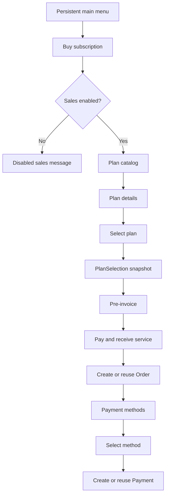
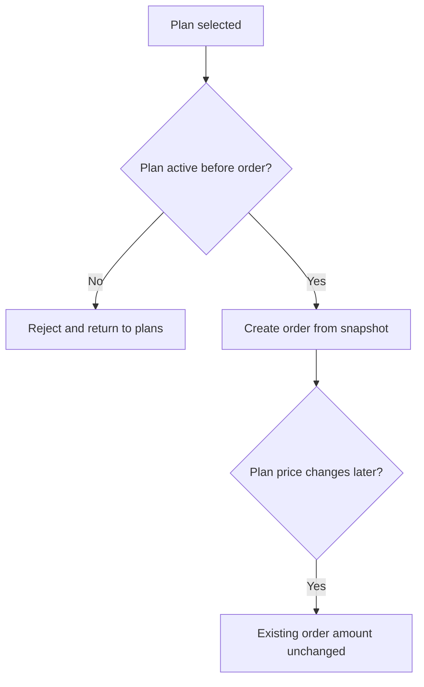

# Telegram Purchase Flow

Task 44 uses these state boundaries:

- Plan catalog and plan details are read-only.
- Selecting a plan creates or reuses a `PlanSelection` and a Telegram purchase session.
- Pre-invoice is rendered from the `PlanSelection` snapshot.
- Continuing to payment creates or reuses one order for that selection.
- Viewing payment methods does not create a payment.
- Selecting a payment method creates or reuses a payment for that method.

Callbacks are signed and expiring. They carry only bounded server-side references.
