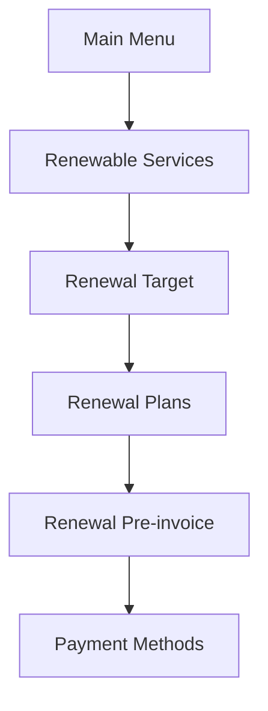
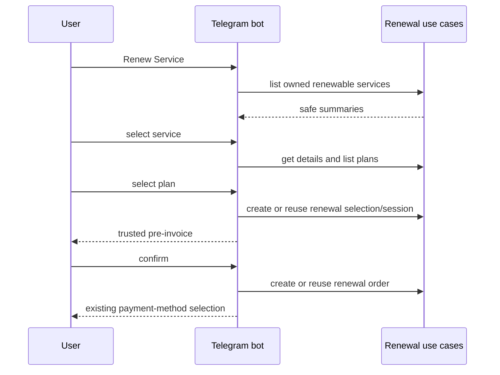
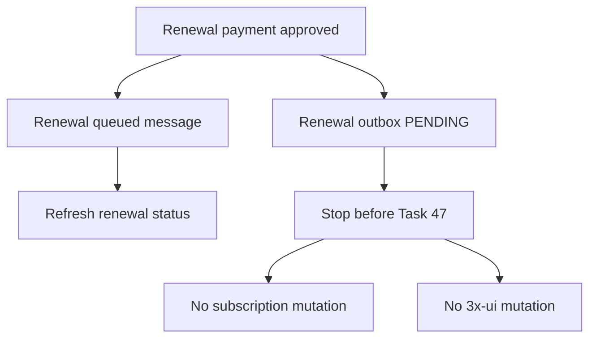
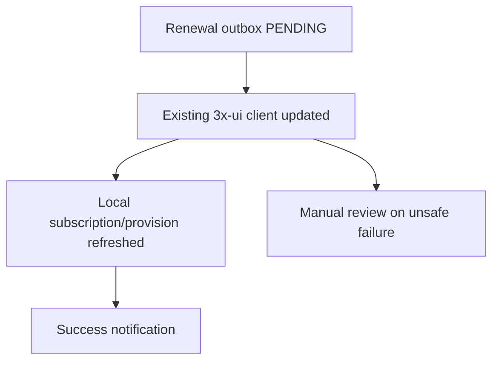

# Telegram Renewal Flow

The `♻️ تمدید سرویس` main-menu action opens the renewal flow.

Back behavior:

- Payment Methods -> Renewal Pre-invoice
- Renewal Pre-invoice -> Renewal Plans
- Renewal Plans -> Renewal Target
- Renewal Target -> Renewable Services

Callbacks are signed, time-bounded, and user-bound. They do not contain price, traffic values, expiry, service username, token, XUI ID, or provider data. Plan selection uses server-side plan reload rather than trusting callback-carried financial values.

Expired selections render the localized expired pre-invoice message and require selecting the service and plan again.

Task 46 post-payment boundary:

Task 47 completion boundary:

