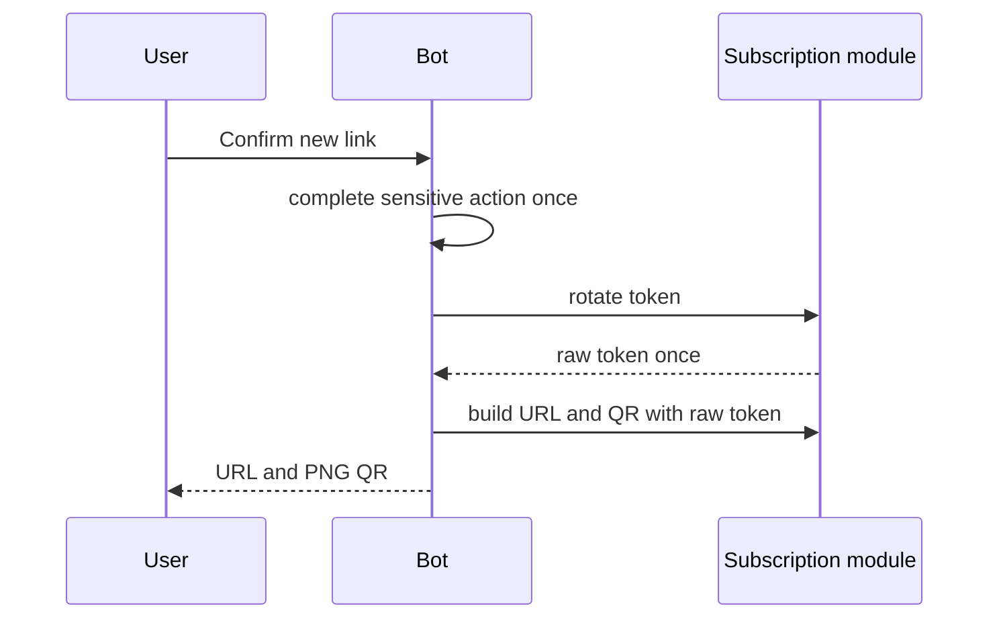

# Telegram Security

The bot token is configured through `TELEGRAM_BOT_TOKEN` and is required only when `TELEGRAM_BOT_ENABLED=true`. It must not be committed or logged.

Credential delivery is private-chat only. Telegram numeric user ID is the trusted external identity; username, display name, callback data, message ID, forwarded data, and chat title are not authorization inputs.

Callback data is signed with HMAC-SHA-256 using `TELEGRAM_BOT_CALLBACK_SIGNING_SECRET`, bound to the Telegram user ID, and time-limited. Callback data never contains:

- subscription token
- subscription URL
- VLESS URI
- QR bytes
- payment references
- private keys

Task 43 service callbacks may carry an internal subscription UUID inside signed callback data, but that value is never displayed. Every service detail, config, QR, and refresh action rechecks:

```text
telegramUserId -> local User -> owned Subscription -> related provision
```

The bot never trusts callback-carried usernames, traffic values, owner IDs, tokens, QR payloads, or VLESS URIs.

Subscription URLs cannot be reconstructed from storage because only token hashes are stored. The Telegram bot therefore generates a new link only after explicit confirmation and token rotation.



Logs include safe IDs and action names only. They must not include bot token, callback secret, subscription token, subscription URL, VLESS URI, QR bytes, XUI credentials, or payment data.
