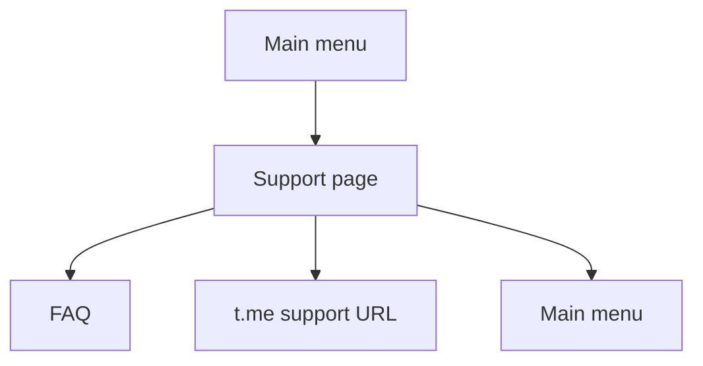

# Telegram Support

Support is configured under `app.telegram.support`.

The support page can show:

- FAQ button.
- Direct Telegram support URL when `telegram-username` and `show-direct-message` are configured.
- Optional working-hours text.

Direct support links are derived as `https://t.me/<username>` by `TelegramSupportUrlFactory`. The bot does not forward customer messages, create tickets, expose an operator inbox, or upload files to support in Task 42.

If support is disabled, the page shows a localized unavailable message and Home navigation.

