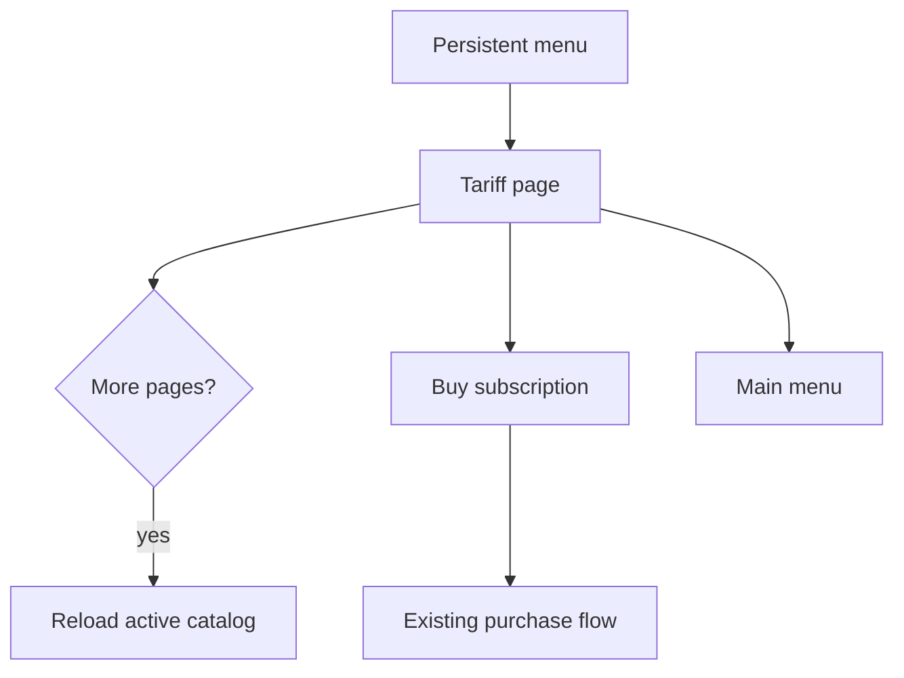

# Telegram Tariffs

The tariff page is a read-only Telegram page backed by `ListAvailablePlansUseCase`.

Displayed fields:

- Plan name, falling back to code when no name exists.
- Traffic limit in gigabytes, or an explicit unlimited label.
- Price from the plan read model, formatted for the user locale.
- Device count when configured.

The page does not create plan selections, orders, payments, or purchase sessions. The `Buy subscription` inline button routes to the existing purchase entry point.

Pagination reloads the active plan catalog on each signed callback. Callback data contains only the page number and action, never prices or plan identifiers.

