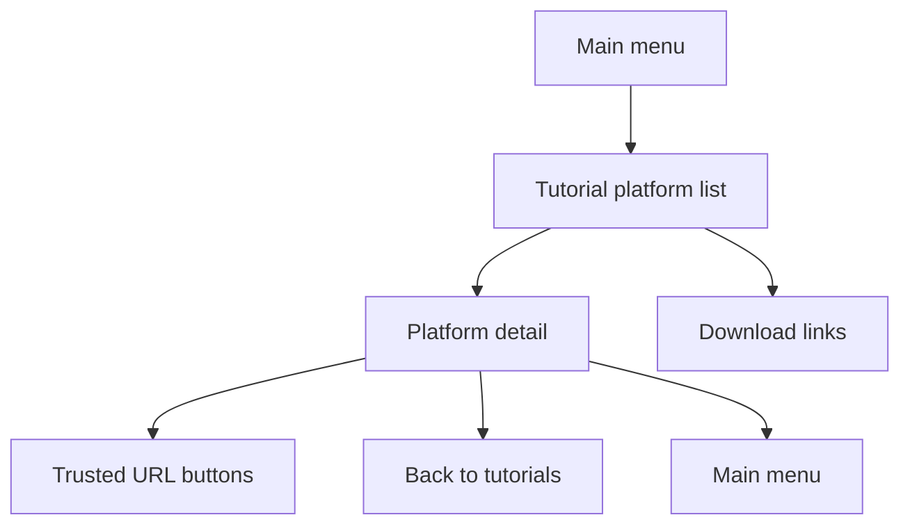

# Telegram Tutorials

Tutorial content is configured under `app.telegram.tutorials` and exposed through immutable application content models.

Supported platform keys:

- `android`
- `ios`
- `windows`
- `linux`
- `macos`
- `downloads`

Enabled platform content requires a title and steps. Disabled platforms may be incomplete. Download links are URL buttons only; the bot does not upload application files or fetch remote tutorial content at runtime.

Long tutorial text is split into bounded message chunks. Only the final chunk contains the inline keyboard.

