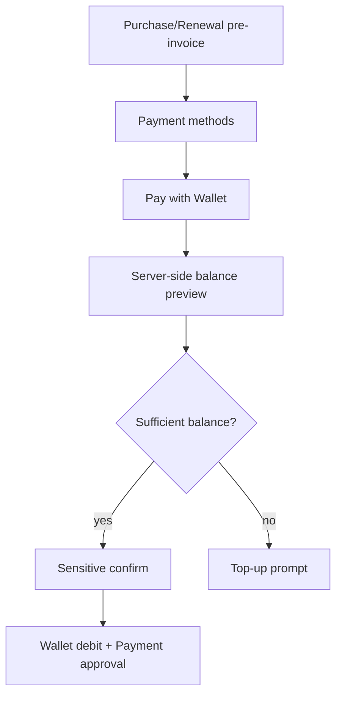

# Telegram Wallet Payment

Wallet payment appears in purchase and renewal payment-method selection when both flags are enabled:

- `app.sales.wallet-payment-enabled=true`
- `app.wallet.payment.enabled=true`

The callback carries only an Order id or sensitive-action id. Amount, balance, currency, Order ownership, and eligibility are reloaded server-side.

Success text says the service is being created or renewal is queued. It never claims provisioning or renewal execution has already completed.
