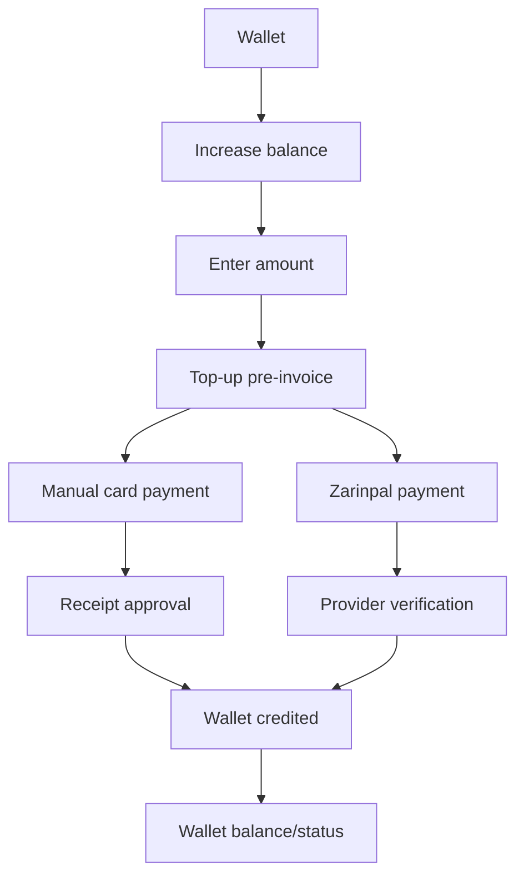

# Telegram Wallet Top-Up

Telegram flow:

Callback payloads carry only signed, user-bound request identifiers. Amount, payment method availability, wallet ownership, and credit amount are reloaded from server-side state.

Top-up status shows customer-facing state only and does not expose provider authorities, internal IDs, idempotency keys, card details in logs, or raw enum names.
