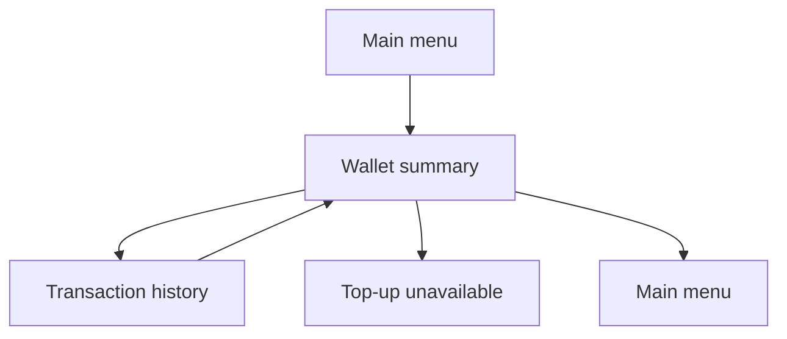

# Telegram Wallet

Task 48 enables a read-only customer wallet page and transaction history.

## Flow

## Customer UI

The wallet page shows:

- current balance;
- transaction count;
- last transaction date;
- transaction history button;
- top-up placeholder button;
- home navigation.

The history page shows customer-friendly credit/debit labels, amount, balance after transaction, and occurred date. It does not expose wallet IDs, transaction IDs, references, idempotency keys, or raw enum names.

Top-up remains unavailable in Task 48 and does not create a `Payment`, `Order`, or ledger entry.
