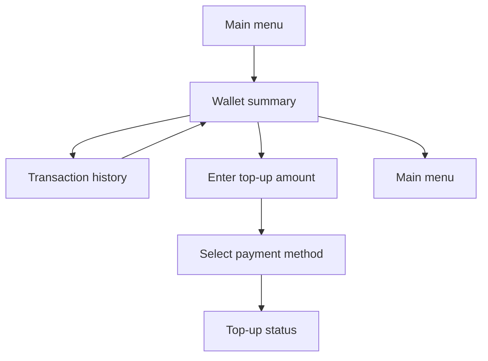

# Telegram Wallet

Task 49 enables a customer wallet page, transaction history, and wallet top-up through existing payment flows.

## Flow

## Customer UI

The wallet page shows:

- current balance;
- transaction count;
- last transaction date;
- transaction history button;
- top-up button;
- home navigation.

The history page shows customer-friendly credit/debit labels, amount, balance after transaction, and occurred date. It does not expose wallet IDs, transaction IDs, references, idempotency keys, or raw enum names.

Top-up creates a `WalletTopUpRequest` and then a typed `Payment` target. The wallet is credited only after verified payment approval posts a `TOP_UP` ledger transaction.
