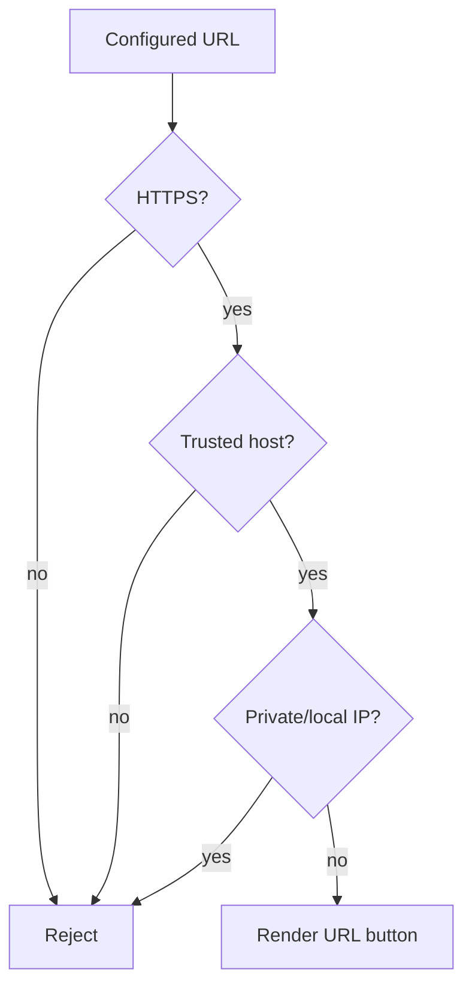

# Trusted Download Links

Tutorial download URLs are validated before use.

Rules:

- HTTPS only.
- Host is required.
- Credentials in URLs are rejected.
- Localhost, loopback, link-local, multicast, and private-network raw IP destinations are rejected.
- Configured allowlists are enforced when present.
- Callback data never contains URLs.

Recommended source types:

- Official website.
- Official GitHub repository.
- Google Play.
- Apple App Store.
- Microsoft Store.
- Project documentation.

Review process:

1. Confirm the target is the official project or store page.
2. Add the host to `TELEGRAM_TUTORIALS_TRUSTED_HOSTS` if needed.
3. Configure the link label, URL, source, and primary flag.
4. Run URL validation tests before deployment.

