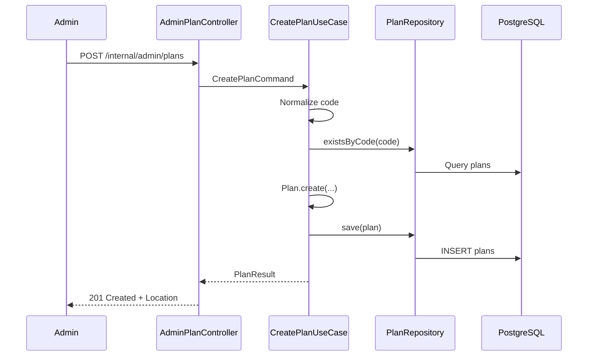
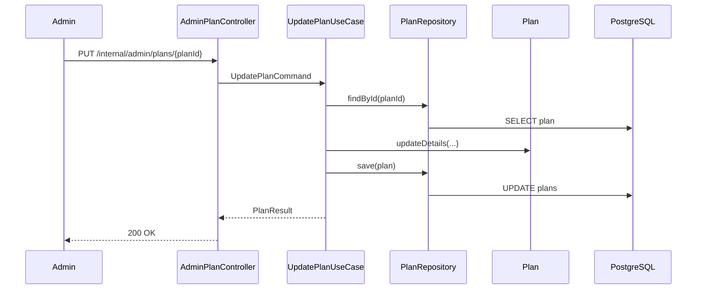
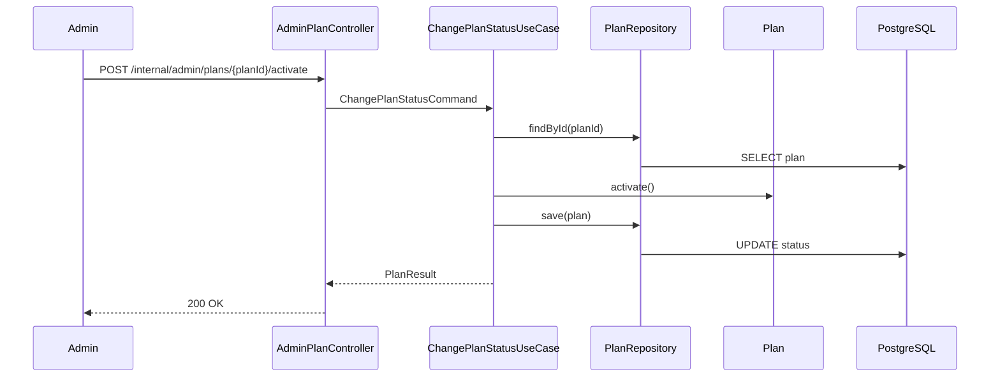
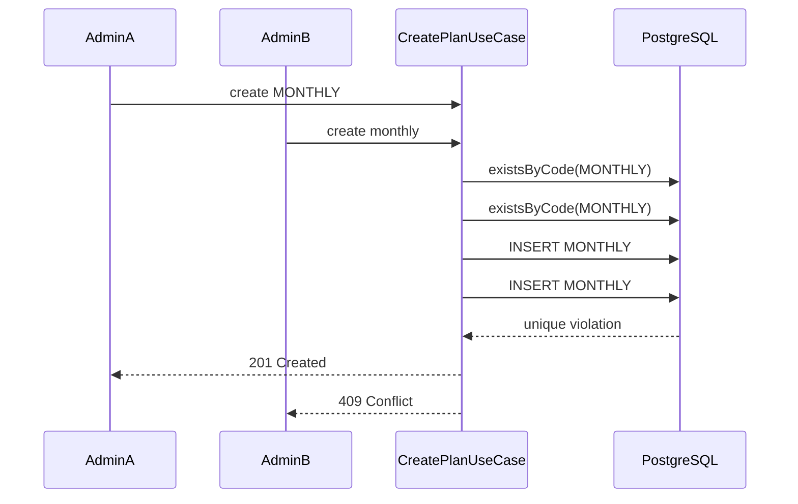

# Internal Admin Plan Management

## Purpose

Internal admin Plan management lets operators create and maintain VPN plans before public plan display, order creation, payment, subscription, Telegram bot handling, 3x-ui integration, and VPN provisioning are implemented.

The API is internal and administrative:

- Base path: `/internal/admin/plans`
- No public user listing is added in this task.
- No real admin authentication or authorization is implemented in this task.
- No physical deletion is supported.

## Create Flow

Admins create a plan with code, name, type, price, currency, duration, traffic limit, optional max devices, and display order. New plans always start as `DRAFT`.

## Update Flow

Admins can update details but cannot change `code` or `status` through the update endpoint. The aggregate revalidates all invariants.

Archived plans cannot be edited. This keeps retired commercial definitions stable for future order, payment, and subscription references.

## Lifecycle Operations

Supported operations:

- `POST /internal/admin/plans/{planId}/activate`
- `POST /internal/admin/plans/{planId}/deactivate`
- `POST /internal/admin/plans/{planId}/archive`

Lifecycle rules remain in the aggregate:

- `DRAFT -> ACTIVE`
- `DRAFT -> ARCHIVED`
- `ACTIVE -> INACTIVE`
- `ACTIVE -> ARCHIVED`
- `INACTIVE -> ACTIVE`
- `INACTIVE -> ARCHIVED`
- `ARCHIVED` has no outgoing transition.

## Immutable Code

`code` is immutable because it is the stable business identifier for future integrations and references. UUIDs remain database identity; codes remain operator-managed product identity.

## No Deletion

Plans are archived instead of deleted because future orders, payments, and subscriptions may refer to them. Physical deletion would make historical references unsafe.

## List Filters

`GET /internal/admin/plans` supports optional filters:

- `status`
- `type`

Examples:

- `/internal/admin/plans`
- `/internal/admin/plans?status=ACTIVE`
- `/internal/admin/plans?type=TRAFFIC_LIMITED`
- `/internal/admin/plans?status=ACTIVE&type=TRAFFIC_LIMITED`

Results are ordered by `displayOrder` ascending and then `code` ascending. Pagination, free-text search, and price filtering are deferred.

## Request And Response Contracts

Create request includes:

- `code`
- `name`
- `description`
- `type`
- `priceAmount`
- `currency`
- `durationDays`
- `trafficLimitBytes`
- `maxDevices`
- `displayOrder`

Update request excludes:

- `id`
- `code`
- `status`

Responses include:

- `id`
- `code`
- `name`
- `description`
- `status`
- `type`
- `priceAmount`
- `currency`
- `durationDays`
- `trafficLimitBytes`
- `maxDevices`
- `displayOrder`
- `available`
- `createdAt`
- `updatedAt`

`available` is derived from `status == ACTIVE`.

## HTTP Status Codes

| Operation | Success | Errors |
| --- | --- | --- |
| Create | `201 Created` | `400` validation, `409` duplicate code |
| List | `200 OK` | `400` invalid enum filter |
| Get by ID | `200 OK` | `400` invalid UUID, `404` missing |
| Get by code | `200 OK` | `400` invalid code, `404` missing |
| Update | `200 OK` | `400` validation, `404` missing, `409` archived |
| Activate | `200 OK` | `404` missing, `409` invalid transition |
| Deactivate | `200 OK` | `404` missing, `409` invalid transition |
| Archive | `200 OK` | `404` missing, `409` invalid transition |

## Validation

Bean Validation handles request shape: required fields, size limits, positive numeric values, and simple code pattern. The domain remains final authority for cross-field rules such as traffic limit consistency.

## Duplicate-Code Handling

The create use case performs an application-level `existsByCode` check for a friendly conflict. PostgreSQL unique constraint remains the final protection for concurrent requests.

The API never exposes SQL messages or constraint names.

## Transaction Boundaries

Create, update, activate, deactivate, and archive run in write transactions. Get and list run in read-only transactions. Controllers are not transactional.

## Logging

Administrative changes are logged at `INFO` with safe structured fields:

- `planId`
- `planCode`
- `oldStatus`
- `newStatus`
- `traceId`

Reads and lists may use `DEBUG`. Full descriptions, request bodies, SQL errors, and credentials are not logged.

## Deferred Work

Real admin security is deferred to a later task. Public plan display is deferred to Task 18. Plan selection, orders, payments, subscriptions, Telegram bot handlers, 3x-ui mapping, and VPN provisioning remain out of scope.
