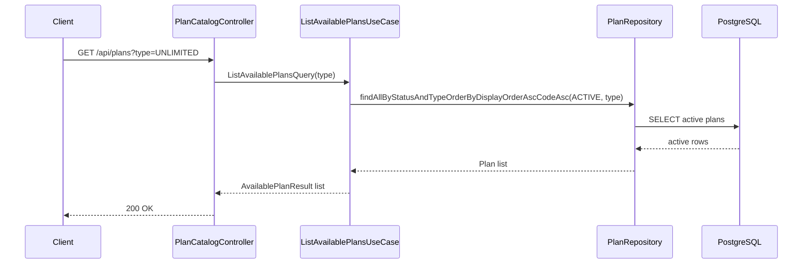
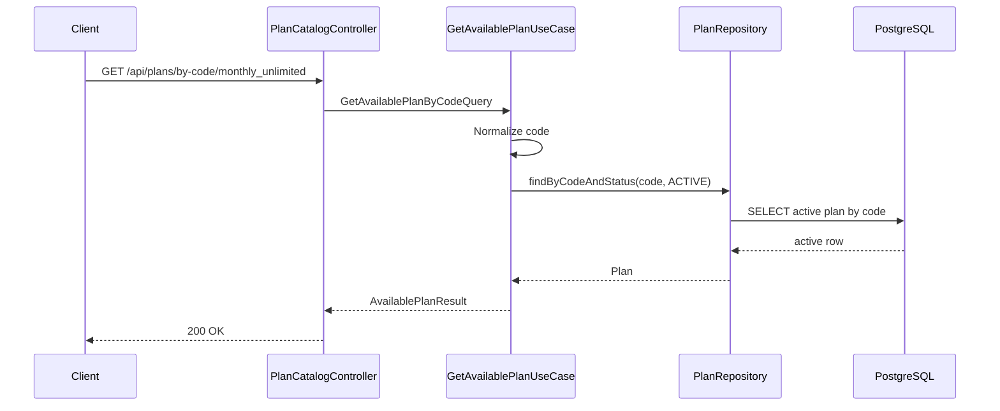
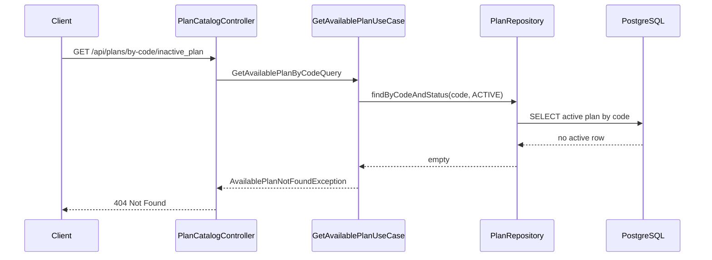

# Available Plan Catalog

## Purpose

The available Plan catalog exposes purchasable VPN plans to user-facing clients. It is read-only and only returns plans whose lifecycle status is `ACTIVE`.

This task does not implement plan selection, carts, orders, payments, subscriptions, Telegram bot handlers, 3x-ui integration, VPN provisioning, discounts, coupons, dynamic pricing, pagination, or user authentication.

## Visibility Rule

Only `ACTIVE` plans are visible.

| Plan status | Catalog behavior |
| --- | --- |
| `DRAFT` | Hidden |
| `ACTIVE` | Visible |
| `INACTIVE` | Hidden |
| `ARCHIVED` | Hidden |

For direct lookup, hidden plans behave exactly like missing plans. The API returns `404 Not Found` and does not reveal whether a hidden plan exists.

## Endpoints

Base path: `/api/plans`

| Method | Path | Description |
| --- | --- | --- |
| `GET` | `/api/plans` | List active plans |
| `GET` | `/api/plans?type=UNLIMITED` | List active plans filtered by type |
| `GET` | `/api/plans/{planId}` | Get an active plan by UUID |
| `GET` | `/api/plans/by-code/{code}` | Get an active plan by normalized code |

There is no status query parameter. Users cannot choose lifecycle state.

## Response Fields

`AvailablePlanResponse` includes:

- `id`
- `code`
- `name`
- `description`
- `type`
- `priceAmount`
- `currency`
- `durationDays`
- `trafficLimitBytes`
- `maxDevices`

It intentionally excludes:

- `status`
- `available`
- `displayOrder`
- `createdAt`
- `updatedAt`
- admin-only fields
- payment, order, subscription, Telegram, or 3x-ui fields

`displayOrder` is used only for server-side ordering.

## Ordering

List results are ordered by:

1. `displayOrder` ascending
2. `code` ascending

## Why Status Is Not Exposed

Every returned plan is active by definition. Exposing status would leak internal lifecycle concepts into the user contract and make hidden-state behavior harder to keep consistent.

## Why Admin DTOs Are Not Reused

Admin DTOs include lifecycle, availability, display order, and audit fields that are intentionally excluded from the catalog. The catalog uses dedicated DTOs to keep the user-facing contract stable and minimal.

## Caching

No cache is added in this task. Plan volume is expected to be small, and correctness after admin updates is more important than avoiding a simple indexed database read. Caching can be added later behind an explicit invalidation strategy.

## Localization

The catalog exposes canonical `name` and `description` only. Formatting and localization belong to later presentation layers such as Telegram or UI clients.

## List Active Plans

## Get Active Plan By Code

## Hidden Plan Lookup

## Deferred Work

Task 19 can build on this catalog for plan selection or the next purchase workflow step. Orders, payments, subscriptions, Telegram presentation, 3x-ui mapping, VPN provisioning, caching, localization, discounts, coupons, and dynamic pricing remain deferred.
