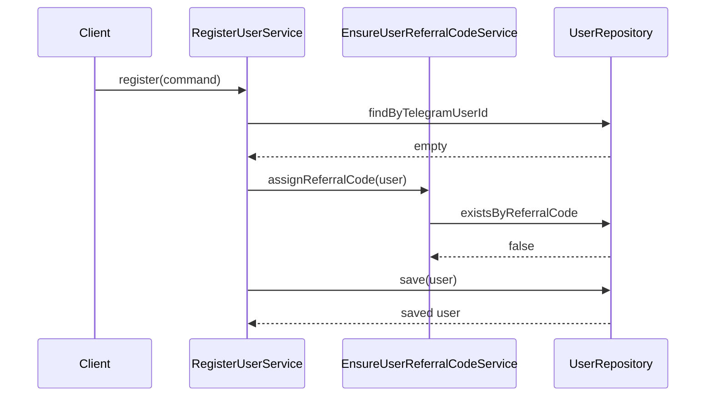
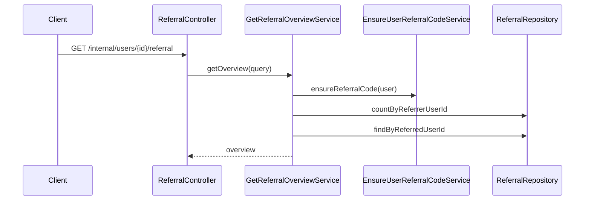
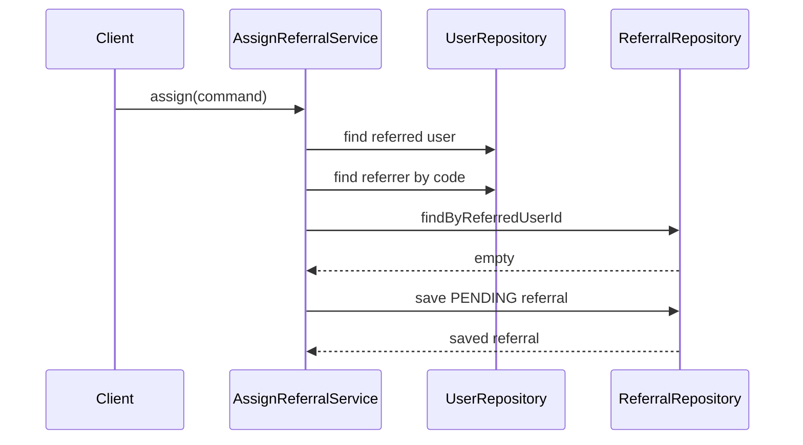
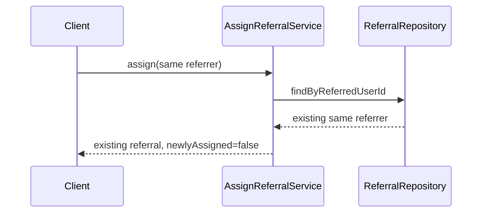
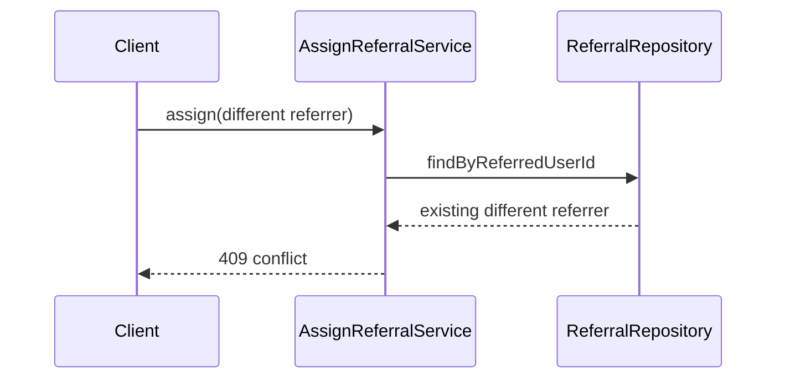

# Referral Skeleton

## Purpose

The referral skeleton gives every user a stable referral code and allows a user
to assign one direct referrer. It intentionally does not implement rewards,
commissions, discounts, wallets, balances, payouts, campaigns, fraud detection,
multi-level referrals, Telegram bot handlers, or Telegram API calls.

## Referral Code Format

Referral codes are stored on `User.referralCode`. Codes are normalized to
uppercase and must be 8 to 16 characters from this non-ambiguous alphabet:

```text
ABCDEFGHJKLMNPQRSTUVWXYZ23456789
```

The alphabet excludes `0`, `O`, `1`, and `I`. The default generated length is
10 and is configurable with `app.referral.code-length` or
`REFERRAL_CODE_LENGTH`.

## Code Generation And Stability

Application code depends on the `ReferralCodeGenerator` port. Infrastructure
provides `SecureReferralCodeGenerator`, which uses `SecureRandom`. Codes are
not derived from Telegram IDs, UUID strings, or sequential identifiers.

Once assigned, a user's referral code is immutable. Profile updates, language
updates, settings updates, repeated registration, and referral assignment do not
regenerate or edit the code.

## Existing-User Backfill

Migration `V4__add_referral_foundation.sql` adds `users.referral_code` as
nullable with a unique constraint. Existing users may temporarily have null
codes. The application lazily assigns a code when a user registers again or
requests their referral overview. A later migration can make the column not null
after all existing users are backfilled.

## Assignment Rules

- The referred user must exist.
- The referrer user must exist and is found by normalized referral code.
- A user cannot refer themselves.
- One referred user may have at most one referrer.
- Repeating the same assignment is idempotent.
- Assigning a different referrer after one exists returns a conflict.
- Referral status starts as `PENDING`.
- `CONFIRMED` and `CANCELLED` are present for future explicit flows only.
- No reward, payment, wallet, balance, discount, or commission state is created.

## Concurrency Strategy

Database constraints are final authority:

- `users.referral_code` is unique.
- `referrals.referred_user_id` is unique.
- `referrals.referrer_user_id <> referrals.referred_user_id` is checked.

Referral inserts run through an isolated creation helper. If concurrent
assignment inserts race, the failed insert transaction rolls back and the outer
flow reloads the existing referral. Same-referrer races return the same referral
idempotently; different-referrer races return one success and one conflict.

## Database Constraints

`referrals` stores scalar user UUIDs rather than JPA relationships. Foreign keys
use PostgreSQL's default restrictive behavior so referral history is not
silently deleted when a user row is deleted. Codes are stored uppercase and the
database check constraint enforces the same allowed alphabet.

## Internal API

### GET `/internal/users/{telegramUserId}/referral`

Success: `200`

```json
{
  "userId": "uuid",
  "telegramUserId": 123456789,
  "referralCode": "ABCD2345EF",
  "referralCount": 3,
  "referrerUserId": "uuid-or-null",
  "referrerTelegramUserId": 987654321
}
```

### POST `/internal/users/{telegramUserId}/referral`

Request:

```json
{
  "referralCode": "ABCD2345EF"
}
```

First assignment returns `201`; idempotent repeat returns `200`.

```json
{
  "referralId": "uuid",
  "referrerUserId": "uuid",
  "referredUserId": "uuid",
  "referralCodeUsed": "ABCD2345EF",
  "status": "PENDING",
  "referredAt": "2026-07-10T12:00:00Z",
  "newlyAssigned": true
}
```

Error behavior:

- Missing user: `404`
- Unknown referral code: `404`
- Self-referral: `400`
- Different existing referrer: `409`
- Invalid request body: `400`

## Sequences

### New-User Referral Code Creation



### Referral Overview



### First Referral Assignment



### Idempotent Repeated Assignment



### Conflicting Assignment



## Deferred Work

Telegram deep-link parsing can call the assignment use case in a later task.
Reward calculation, fraud checks, payout state, wallet balances, campaigns, and
multi-level referral logic belong in future modules and are deliberately absent
from this skeleton.

## Test Guarantees

Phase 2 tests verify stable referral-code creation, lazy backfill, case-insensitive assignment input, first assignment, idempotent repeat assignment, conflicting referrer rejection, self-referral rejection, unknown-code rejection, referral counts, one referral row per referred user, concurrency recovery, and preservation of user language/settings. No reward, wallet, commission, Telegram, payment, or future-phase behavior is introduced.
