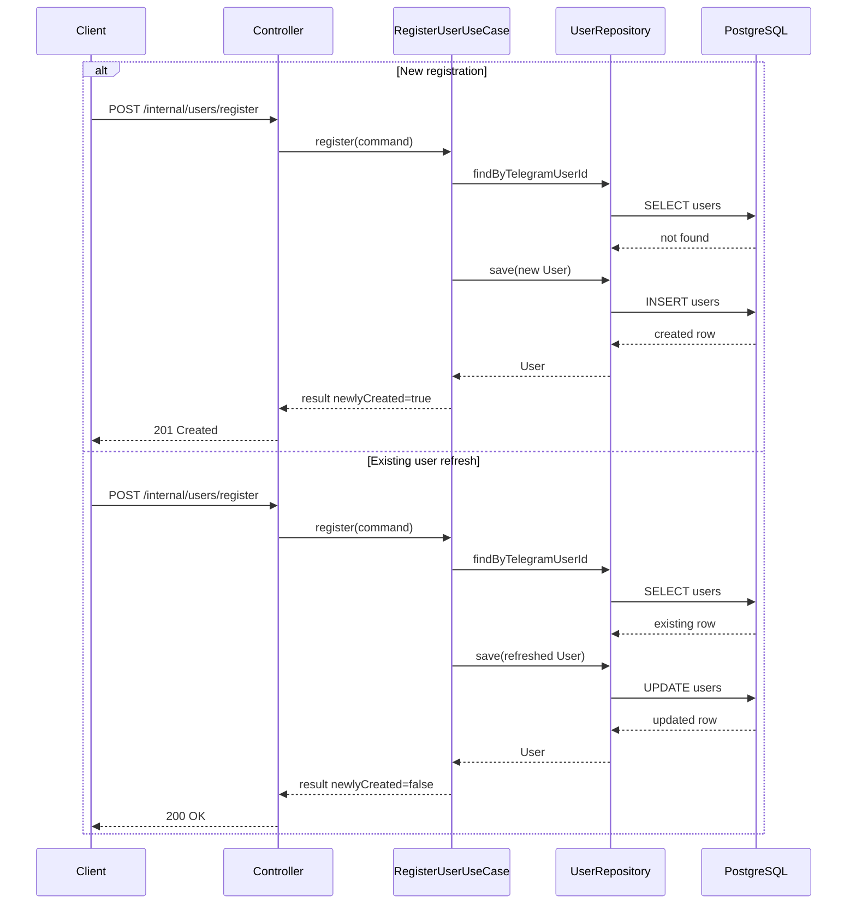

# Register User Use Case

## Purpose

Register a Telegram user in an idempotent way. The use case creates the user
when the Telegram identity is unknown and refreshes Telegram profile data when
the identity already exists.

This task does not connect to Telegram. It only exposes a temporary internal
HTTP endpoint for verification.

## Input Fields

- `telegramUserId`: required, positive Telegram user identifier.
- `username`: optional Telegram username, max 64 characters.
- `firstName`: required Telegram first name, nonblank, max 128 characters.
- `lastName`: optional Telegram last name, max 128 characters.
- `languageCode`: optional Telegram language code, max 16 characters.

The application command is independent of Telegram SDK classes and persistence
annotations.

## Validation Rules

The API uses Bean Validation for request shape. The application service also
validates command-level invariants so non-HTTP callers receive the same
protection.

Invalid input raises `InvalidRegistrationCommandException`, which maps to HTTP
400 through the common exception handling convention.

## Field Normalization

Normalization is performed by the `User` aggregate:

- Strings are trimmed.
- Blank optional strings become `null`.
- A leading `@` is removed from usernames.
- `firstName` must remain nonblank.

## Language Resolution

`UserLanguageResolver` resolves initial language only for new users:

- `fa`, `fa-IR`, and codes starting with `fa` resolve to `FA`.
- `en`, `en-US`, and codes starting with `en` resolve to `EN`.
- Matching is case-insensitive.
- `_` is normalized to `-`.
- Null, blank, and unsupported codes default to `FA`.

Explicit language changes are handled by the dedicated user-language use case.

## New-User Flow

1. Validate command.
2. Resolve initial language from `languageCode`.
3. Read by `telegramUserId`.
4. If absent, create `User` through the aggregate factory.
5. Save through `UserRepository`.
6. Return `RegisterUserResult` with `newlyCreated=true`.

New users start with:

- resolved initial language;
- `ACTIVE` status;
- `blocked=false`;
- `lastInteractionAt` set from `SystemClockPort`.

## Existing-User Flow

1. Validate command.
2. Read by `telegramUserId`.
3. Update Telegram profile fields.
4. Record latest interaction time from `SystemClockPort`.
5. Save through `UserRepository`.
6. Return `RegisterUserResult` with `newlyCreated=false`.

Repeated registration preserves:

- selected language;
- status;
- blocked state;
- original `createdAt`.

Re-registration never unblocks, activates, unsuspends, or changes the selected
language.

## Idempotency Behavior

The use case is idempotent by Telegram identity:

- repeated calls for the same `telegramUserId` return the same internal user ID;
- repeated calls do not increase row count;
- profile fields and `lastInteractionAt` are refreshed;
- the database unique constraint on `telegram_user_id` is the final authority.

## Transaction Boundary

`RegisterUserService.register` owns the application transaction. Controllers do
not define transactions. Repository adapters do not own business transaction
flow.

## Concurrency Strategy

Concurrent first registrations can race across multiple application instances.
The strategy is:

1. read with `findByTelegramUserId`;
2. attempt creation in a separate `REQUIRES_NEW` transaction;
3. let PostgreSQL enforce the unique `telegram_user_id` constraint;
4. on `DataIntegrityViolationException`, reload the existing user in the outer
   transaction;
5. refresh Telegram profile data and return `newlyCreated=false`.

This avoids JVM locks and avoids continuing inside a transaction that may have
been marked rollback-only by a failed insert.

## HTTP Verification Endpoint

Temporary internal endpoint:

```http
POST /internal/users/register
Content-Type: application/json
```

Request:

```json
{
  "telegramUserId": 123456789,
  "username": "example_user",
  "firstName": "Ali",
  "lastName": "Ahmadi",
  "languageCode": "fa"
}
```

Response:

```json
{
  "userId": "uuid",
  "telegramUserId": 123456789,
  "username": "example_user",
  "firstName": "Ali",
  "lastName": "Ahmadi",
  "language": "FA",
  "status": "ACTIVE",
  "blocked": false,
  "newlyCreated": true,
  "registeredAt": "2026-07-10T12:00:00Z",
  "lastInteractionAt": "2026-07-10T12:00:00Z"
}
```

Status codes:

- `201 Created`: a new row was created.
- `200 OK`: an existing user was refreshed.
- `400 Bad Request`: invalid command or malformed request.
- `500 Internal Server Error`: unexpected unrecoverable registration failure.

No `Location` header is returned because no stable public user resource URL
exists yet.

## Failure Behavior

Duplicate concurrent registration is recovered and does not produce an error
when the existing user can be loaded. Raw SQL errors and constraint names are
not exposed to clients.

## Deferred Telegram Integration

The Telegram bot handler and Telegram API integration are intentionally deferred
to a later task. This use case accepts plain application data and contains no
Telegram SDK types.

## Sequence Diagram


