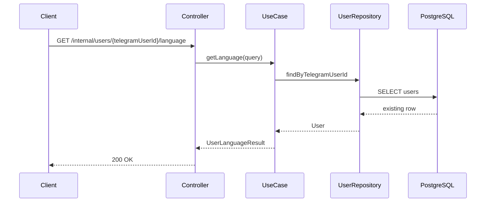
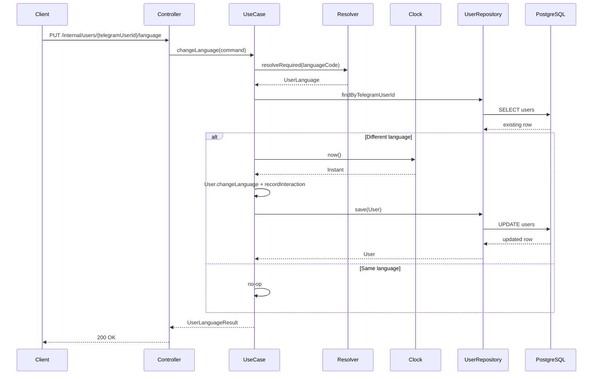

# User Language Use Case

## Purpose

Read and change a registered user's preferred language independently from the
general profile flow. This use case does not add Telegram handlers, Telegram API
calls, referral, plans, payments, subscriptions, 3x-ui, admin functionality, or
localization message storage.

## Supported Languages

- `FA`
- `EN`

Registration accepts Telegram-style language codes. Explicit language changes
accept language codes but apply strict validation.

## Resolution Rules

Registration uses defaulting resolution:

- `fa`, `fa-IR`, and codes starting with `fa` resolve to `FA`.
- `en`, `en-US`, and codes starting with `en` resolve to `EN`.
- Matching is case-insensitive.
- Input is trimmed.
- `_` is normalized to `-`.
- Null, blank, and unsupported values default to `FA`.

Explicit language changes use strict resolution:

- Supported `fa*` and `en*` values are accepted.
- Null, blank, and unsupported values are rejected with `400 Bad Request`.
- Unsupported values are not defaulted.

## Application Boundary

Input ports:

- `GetUserLanguageUseCase`
- `ChangeUserLanguageUseCase`

Application models:

- `GetUserLanguageQuery`
- `ChangeUserLanguageCommand`
- `UserLanguageResult`

The use cases return DTO results and never expose the `User` aggregate or JPA
entity internals.

## HTTP Contracts

Temporary internal endpoints:

```http
GET /internal/users/{telegramUserId}/language
PUT /internal/users/{telegramUserId}/language
Content-Type: application/json
```

PUT request:

```json
{
  "languageCode": "en"
}
```

Response:

```json
{
  "userId": "00000000-0000-0000-0000-000000000000",
  "telegramUserId": 123456789,
  "language": "EN",
  "updatedAt": "2026-07-10T12:00:00Z"
}
```

Status codes:

- `200 OK`: language read or changed.
- `400 Bad Request`: invalid path variable, malformed JSON, blank language code,
  or unsupported language code.
- `404 Not Found`: no user exists for the Telegram identity.
- `500 Internal Server Error`: unexpected failures.

Error responses use the standard API error body with `traceId` and no stack
trace or SQL details.

## Idempotency And Audit

Changing to a different supported language updates the aggregate through
`User.changeLanguage(...)`, records interaction time explicitly, saves through
`UserRepository`, and returns the persisted `updatedAt`.

Changing to the same language is idempotent. The service does not save, does not
record a new interaction, and returns the existing `updatedAt`.

Reading language is read-only. It does not update `lastInteractionAt` and does
not save the user.

## Transaction Boundaries

- `GetUserLanguageService` uses a read-only transaction.
- `ChangeUserLanguageService` owns the write transaction.
- Controllers do not define transactions.

## Relation To User Profile

The profile update use case owns editable profile names only: `firstName` and
`lastName`. Profile reads may include the current language as part of the read
model, but explicit language changes are handled exclusively by this use case.

## Future Work

Telegram keyboard integration is deferred to a later task. The localization
message system is also deferred; this task stores only the user's preferred
language.

## Get Language Sequence



## Change Language Sequence



## Test Guarantees

Phase 2 tests verify default registration language behavior, supported FA and EN variants, unsupported explicit language rejection, same-language idempotency, profile/status/blocked preservation, controller validation errors, and stable trace IDs in error responses.
