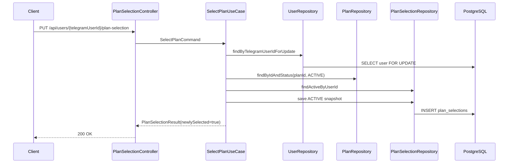
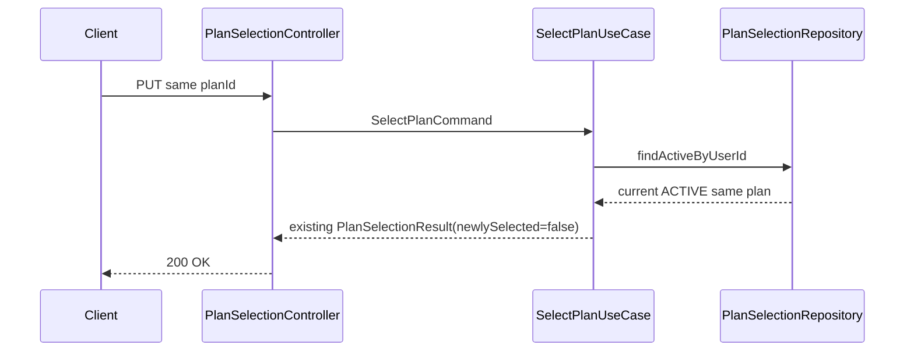
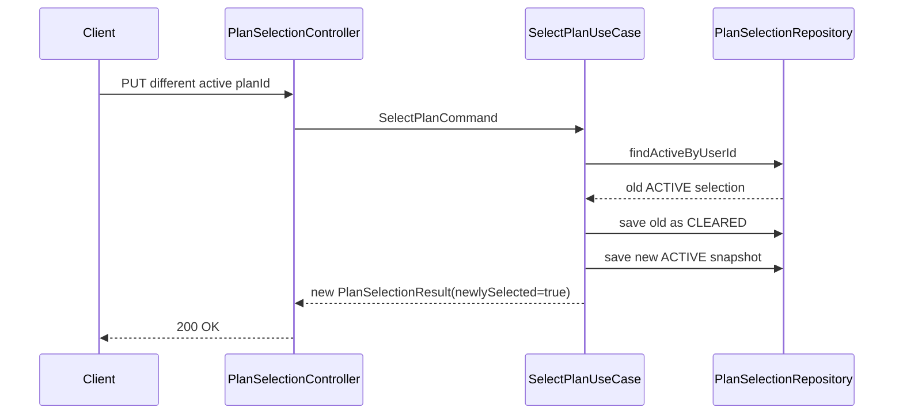
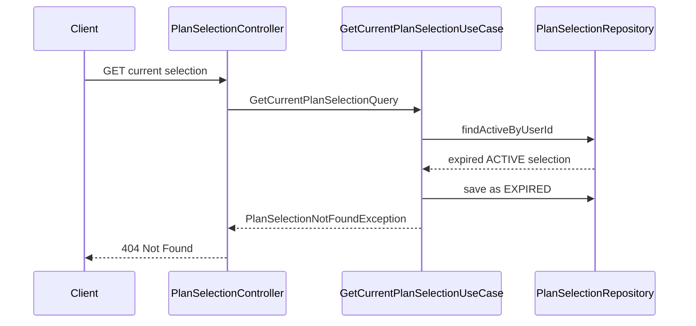
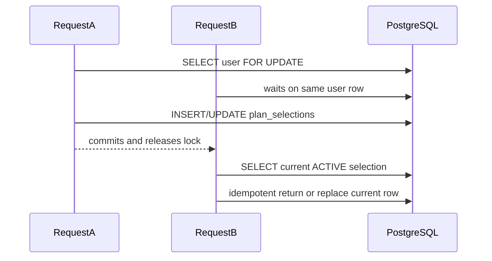

# User Plan Selection

## Purpose

Plan selection records a registered user's temporary intent to purchase one currently available VPN plan.

It is not an order, payment, subscription, VPN account, 3x-ui client, Telegram handler, reservation, discount, coupon, or price guarantee.

## Current Selection Design

`PlanSelection` is stored in `plan_selections`.

The table keeps historical rows and allows only one current active row per user through a PostgreSQL partial unique index:

```sql
CREATE UNIQUE INDEX uq_plan_selections_one_active_per_user
ON plan_selections (user_id)
WHERE status = 'ACTIVE';
```

Terminal rows remain for audit/debugging:

- `CLEARED`
- `EXPIRED`
- `CONSUMED`

`CONSUMED` is modeled for a future order flow but is not used in this task.

## Snapshot Strategy

The selection stores scalar IDs and immutable plan snapshots:

- `userId`
- `planId`
- `planCodeSnapshot`
- `planNameSnapshot`
- `planTypeSnapshot`
- `priceAmountSnapshot`
- `currencySnapshot`
- `durationDaysSnapshot`
- `trafficLimitBytesSnapshot`
- `maxDevicesSnapshot`

There are no JPA relationships to `User` or `Plan`.

Snapshots protect the next order/payment phase from later plan edits. If an admin changes a plan name, price, duration, or traffic limit after selection, the existing selection still contains the values the user selected.

## Expiration

Selections expire after:

```properties
app.plan-selection.ttl=PT30M
```

`.env.example` exposes:

```properties
PLAN_SELECTION_TTL=PT30M
```

The TTL is an ISO-8601 duration and must be positive.

Expiration is evaluated when the current selection is read, replaced, or cleared. There is no scheduled cleanup job in this task.

## Replacement Behavior

Selecting a plan performs these steps:

1. Load the user by Telegram user ID.
2. Verify user eligibility.
3. Load the requested plan only if it is `ACTIVE`.
4. Load the user's current active selection.
5. If the current selection is expired, mark it `EXPIRED`.
6. If the same non-expired plan is already selected, return it with `newlySelected=false`.
7. If another non-expired plan is selected, mark the old row `CLEARED`.
8. Create a new `ACTIVE` snapshot row with `newlySelected=true`.

Clearing a selection marks the row `CLEARED`. It does not delete the row.

No current selection returns `404 Not Found` for `GET` and `DELETE`.

## Eligibility Rules

Only users that are:

- `UserStatus.ACTIVE`
- not blocked

may select a plan.

Blocked, inactive, and suspended users receive `403 Forbidden`.

Eligibility checks do not mutate the user.

## Hidden Plan Behavior

Only `ACTIVE` plans can be selected.

`DRAFT`, `INACTIVE`, and `ARCHIVED` plans behave as not found and return `404 Not Found`. The response does not reveal hidden lifecycle state.

## Database Constraints

The migration adds:

- foreign key to `users(id)`
- foreign key to `plans(id)`
- status check for `ACTIVE`, `CLEARED`, `EXPIRED`, `CONSUMED`
- plan type check for `TRAFFIC_LIMITED`, `UNLIMITED`
- non-negative price snapshot check
- positive duration snapshot check
- positive max-devices snapshot check when present
- traffic consistency check
- `expires_at > selected_at`
- indexes on `user_id`, `plan_id`, `status`, `expires_at`, and `selected_at`
- partial unique index for one active selection per user

Foreign keys use PostgreSQL default `NO ACTION` behavior. Selection history is not silently deleted when a user or plan deletion is attempted.

## Concurrency Strategy

The service loads the user row using a PostgreSQL pessimistic write lock for selection writes. This serializes concurrent selection requests for the same user without JVM locks.

The partial unique index remains the final database safety net.

Concurrent same-plan selection:

- one request creates the active row;
- the other waits, reloads the current row, and returns it idempotently with `newlySelected=false`;
- exactly one active row remains.

Concurrent different-plan selection:

- requests are serialized by the user-row lock;
- the later transaction clears the earlier active selection and creates its own active row;
- exactly one active row remains.

If the database still reports an active-selection uniqueness conflict, the API returns `409 Conflict` with a safe message.

## API Contract

Base path:

```text
/api/users/{telegramUserId}/plan-selection
```

### Select

```http
PUT /api/users/{telegramUserId}/plan-selection
Content-Type: application/json

{
  "planId": "uuid"
}
```

Response: `200 OK`

Repeated selection of the same active plan returns `newlySelected=false`.

### Get Current

```http
GET /api/users/{telegramUserId}/plan-selection
```

Response: `200 OK` when a current valid selection exists.

No selection or expired selection returns `404 Not Found`.

### Clear

```http
DELETE /api/users/{telegramUserId}/plan-selection
```

Response: `200 OK` with status `CLEARED`.

No current selection returns `404 Not Found`.

## Response Fields

`PlanSelectionResponse` includes:

- `selectionId`
- `planId`
- `planCode`
- `planName`
- `planType`
- `priceAmount`
- `currency`
- `durationDays`
- `trafficLimitBytes`
- `maxDevices`
- `status`
- `selectedAt`
- `expiresAt`
- `newlySelected`

It excludes:

- internal `userId`
- `telegramUserId`
- JPA audit fields
- order, payment, subscription, Telegram, VPN, and 3x-ui fields

## HTTP Status Codes

| Scenario | Status |
| --- | --- |
| Select first/current/replacement plan | `200 OK` |
| Get current selection | `200 OK` |
| Clear current selection | `200 OK` |
| Missing user | `404 Not Found` |
| Missing or hidden plan | `404 Not Found` |
| Missing current selection | `404 Not Found` |
| Expired current selection | `404 Not Found` |
| Ineligible user | `403 Forbidden` |
| Concurrent conflict | `409 Conflict` |
| Invalid UUID/body/path | `400 Bad Request` |

All error responses include `timestamp`, `status`, `error`, `message`, `path`, and `traceId`.

## First Selection



## Same-Plan Idempotency



## Replacing Selection



## Expired Lookup



## Concurrent Selection Conflict



## Deferred Work

Task 19 does not add checkout, orders, payments, subscriptions, Telegram bot handling, 3x-ui integration, VPN provisioning, coupons, discounts, scheduled cleanup, or authentication.

Task 20 remains future work and is not started here. A later order task, currently expected around Task 31, can consume active selections and transition them to `CONSUMED`.
