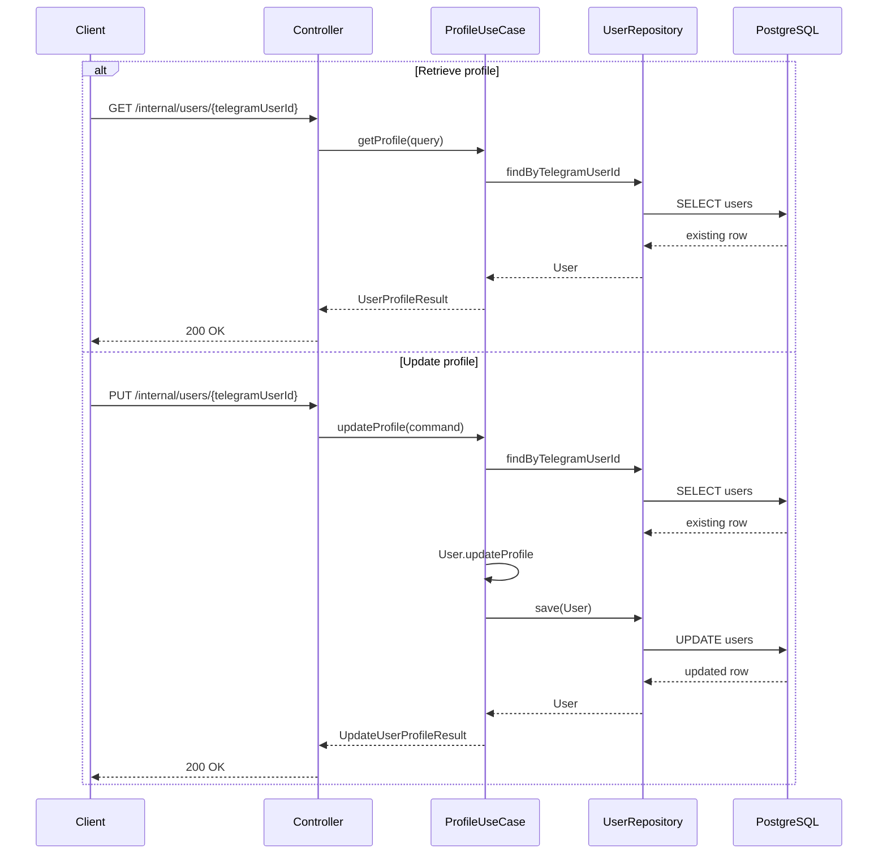

# User Profile Use Case

## Purpose

Retrieve and update the editable profile fields for a registered Telegram user.
This use case builds on registration and does not add Telegram bot handling,
authentication, authorization, referral, payment, subscription, or panel logic.

## Read Model

Profile retrieval returns:

- `telegramUserId`
- `username`
- `firstName`
- `lastName`
- `language`
- `status`
- `blocked`
- `createdAt`
- `updatedAt`
- `lastInteractionAt`

The response is a DTO. The `User` JPA entity is never exposed directly.

## Editable Fields

Only these fields can be changed through profile update:

- `firstName`
- `lastName`
- `language`

Immutable in this use case:

- `telegramUserId`
- `username`
- `status`
- `blocked`
- `createdAt`
- `lastInteractionAt`

`updatedAt` changes through JPA auditing when the profile update persists.

## Validation Rules

- `telegramUserId` must be present and positive.
- `firstName` is required, trimmed, nonblank, and at most 128 characters.
- `lastName` is optional, trimmed, and at most 128 characters.
- Blank `lastName` becomes `null`.
- `language` is required and must be one of the supported `UserLanguage` enum
  values.

Unsupported language values are rejected. They are not defaulted. Telegram
language-code defaulting remains limited to the registration use case.

## Retrieval Flow

1. Validate `GetUserProfileQuery`.
2. Load the user by `telegramUserId` through `UserRepository`.
3. Return `UserProfileResult`.
4. Log profile viewing with `telegramUserId`; trace ID is supplied by MDC.

## Update Flow

1. Validate `UpdateUserProfileCommand`.
2. Load the user by `telegramUserId` through `UserRepository`.
3. Call `User.updateProfile(firstName, lastName, language)`.
4. Save through `UserRepository`.
5. Return `UpdateUserProfileResult`.
6. Log profile update with `telegramUserId`; trace ID is supplied by MDC.

The update operation owns the transaction boundary in
`UpdateUserProfileService`. Controllers do not define transactions.

## HTTP Verification Endpoints

Temporary internal endpoints:

```http
GET /internal/users/{telegramUserId}
PUT /internal/users/{telegramUserId}
Content-Type: application/json
```

PUT request:

```json
{
  "firstName": "Sara",
  "lastName": "Karimi",
  "language": "EN"
}
```

Response:

```json
{
  "telegramUserId": 123456789,
  "username": "example_user",
  "firstName": "Sara",
  "lastName": "Karimi",
  "language": "EN",
  "status": "ACTIVE",
  "blocked": false,
  "createdAt": "2026-07-10T12:00:00Z",
  "updatedAt": "2026-07-10T12:05:00Z",
  "lastInteractionAt": "2026-07-10T12:00:00Z"
}
```

Status codes:

- `200 OK`: profile retrieved or updated.
- `400 Bad Request`: invalid path variable, invalid body, or unsupported enum.
- `404 Not Found`: no user exists for the Telegram identity.
- `500 Internal Server Error`: unexpected failures.

## Sequence Diagram


