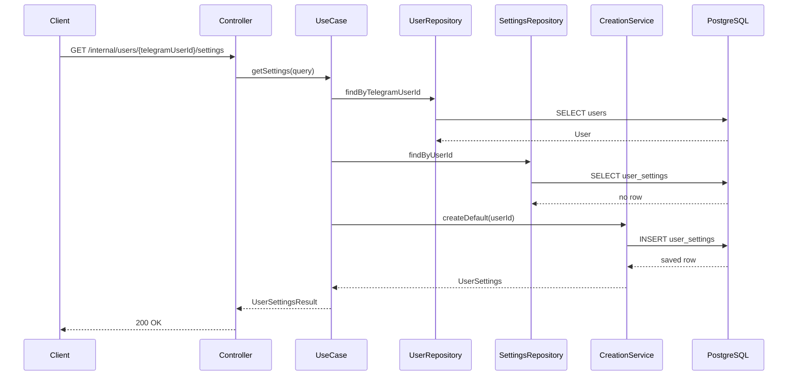
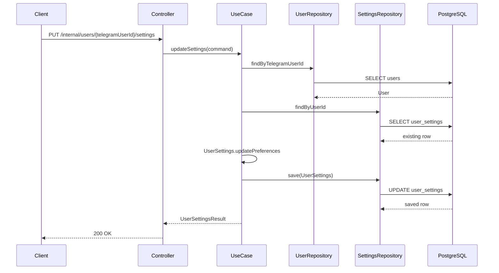
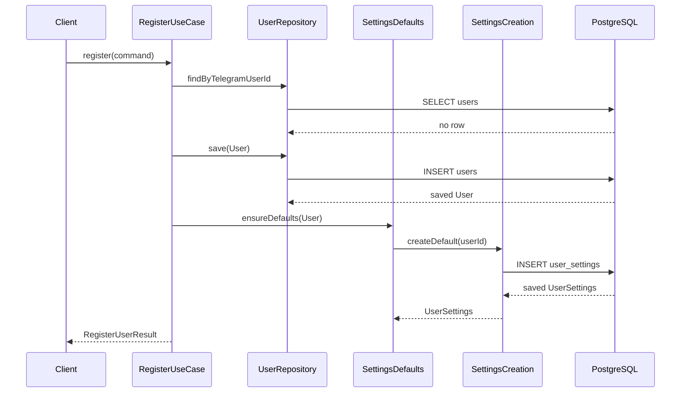

# User Settings Use Case

## Purpose

`UserSettings` stores user-specific preferences separately from the core `User`
profile. The settings foundation supports future Telegram notifications,
renewal reminders, usage alerts, and other preference-driven behavior without
polluting the `User` aggregate.

This task does not implement Telegram handlers, Telegram API calls, reminder
jobs, notification delivery, referral, plans, payments, subscriptions, 3x-ui, or
admin features.

## Separation From User Profile

`User` remains responsible for Telegram identity, profile names, language,
status, blocked state, and interaction timestamps. `UserSettings` is a separate
JPA entity keyed by the owning user's UUID. There is no bidirectional JPA
relationship and no settings fields are stored on `User`.

## Fields

- `settingsId`: settings row UUID.
- `userId`: owning `User` UUID.
- `telegramUserId`: Telegram identity returned for API convenience.
- `notificationsEnabled`: master notification preference.
- `renewalRemindersEnabled`: stored renewal reminder preference.
- `usageAlertsEnabled`: stored usage alert preference.
- `usageAlertThresholdPercent`: percentage threshold for future usage alerts.
- `createdAt`: audit creation timestamp.
- `updatedAt`: audit update timestamp.

## Defaults

Default settings are:

- `notificationsEnabled=true`
- `renewalRemindersEnabled=true`
- `usageAlertsEnabled=true`
- `usageAlertThresholdPercent=80`

## Validation Rules

- `userId` is required.
- `telegramUserId` is required and positive at the use-case boundary.
- All PUT request fields are required.
- `usageAlertThresholdPercent` must be between 1 and 100.
- Same-value updates are valid and idempotent.
- If `notificationsEnabled=false`, reminder and alert preferences remain stored;
  no delivery logic is implemented in this task.

## One Settings Row Per User

The database enforces one settings record per user with:

- `UNIQUE (user_id)`
- foreign key `user_settings.user_id -> users.id`
- `ON DELETE CASCADE`

Settings have no meaning without the owning user, so deleting a user deletes the
settings row at the database level. This does not introduce JPA cascading or an
entity relationship.

## Creation Strategy

Registration ensures defaults exist after saving a user:

1. New user registration creates `User`.
2. The saved user receives default `UserSettings`.
3. Existing user registration refreshes profile data.
4. Existing settings are preserved.
5. Missing settings for an existing user are recreated.

Settings reads and updates also lazily create defaults if an existing user has
no settings row.

## Concurrency Behavior

Default creation first checks for an existing row, then attempts insert. The
unique `user_id` constraint remains the final authority. Concurrent duplicate
creation is recovered by reading the existing settings row after the duplicate
insert fails. No JVM locks or event mechanism are used.

## HTTP Contracts

Temporary internal endpoints:

```http
GET /internal/users/{telegramUserId}/settings
PUT /internal/users/{telegramUserId}/settings
Content-Type: application/json
```

PUT request:

```json
{
  "notificationsEnabled": true,
  "renewalRemindersEnabled": true,
  "usageAlertsEnabled": true,
  "usageAlertThresholdPercent": 80
}
```

Response:

```json
{
  "settingsId": "00000000-0000-0000-0000-000000000000",
  "userId": "11111111-1111-1111-1111-111111111111",
  "telegramUserId": 123456789,
  "notificationsEnabled": true,
  "renewalRemindersEnabled": true,
  "usageAlertsEnabled": true,
  "usageAlertThresholdPercent": 80,
  "createdAt": "2026-07-10T12:00:00Z",
  "updatedAt": "2026-07-10T12:00:00Z"
}
```

Status codes:

- `200 OK`: settings returned or updated.
- `400 Bad Request`: invalid path variable, malformed JSON, missing field, or
  invalid threshold.
- `404 Not Found`: no user exists for the Telegram identity.
- `500 Internal Server Error`: unexpected persistence or runtime failures.

Errors use the standard API error body with `traceId`, no stack trace, no SQL
details, and no constraint names.

## Transaction Boundaries

- Registration owns the user registration transaction and delegates default
  settings creation to a small `REQUIRES_NEW` helper for duplicate recovery.
- `GetUserSettingsService` uses a write-capable transaction because it may lazily
  create defaults.
- `UpdateUserSettingsService` owns the settings update transaction.
- Controllers do not define transactions.

## Future Integration

Future Telegram keyboard handlers can call these use cases. Future reminder jobs
and notification delivery should read these preferences before sending anything.
This task intentionally defers delivery, scheduling, Telegram chat settings,
payment preferences, theme, timezone, and additional locale settings.

## Lazy Settings Creation



## Settings Update



## New-User Registration With Defaults


