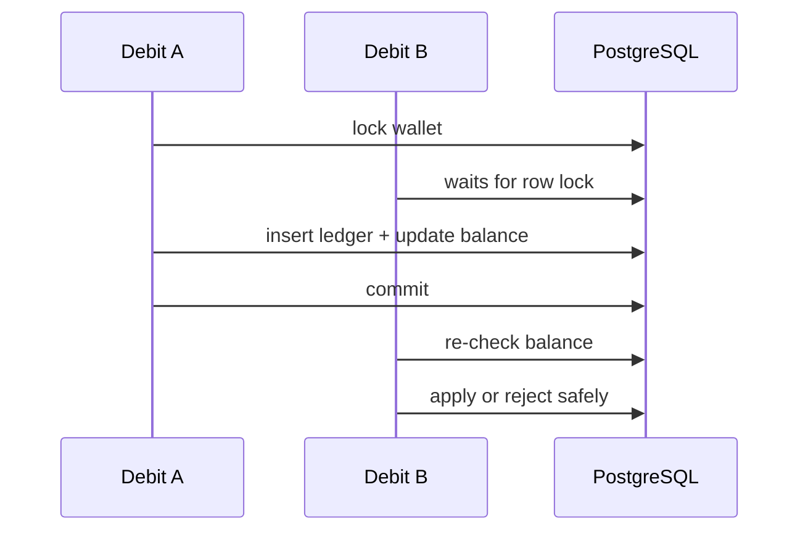

# Wallet Concurrency

Wallet correctness relies on PostgreSQL, row locks, optimistic entity versioning, and uniqueness constraints.

## Guarantees

- Concurrent wallet creation produces one wallet due to `wallets.user_id` uniqueness.
- Credit/debit operations lock the wallet row before checking idempotency and balance.
- Concurrent debits cannot drive the materialized balance below zero.
- Duplicate commands cannot create duplicate ledger rows.
- The JVM does not use `synchronized` as the correctness mechanism.

