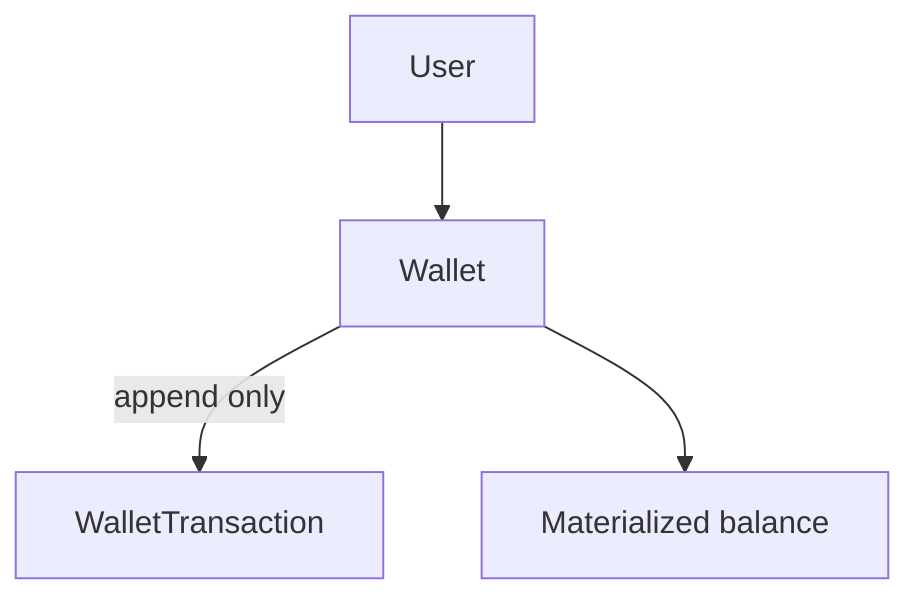

# Wallet Domain

Task 48 introduces one customer wallet per `User`.

## Model

- `Wallet` owns the materialized current balance.
- `WalletStatus` is `ACTIVE`, `LOCKED`, or `CLOSED`.
- A new wallet starts `ACTIVE` with zero `IRT`.
- Wallet ownership is immutable through `user_id`.
- Balance changes are only allowed through wallet domain methods and application use cases.
- Task 48 does not implement top-up payments, wallet purchases, refunds, gifts, referrals, discounts, or withdrawals.

## Currency

The wallet uses the existing `Money` and `CurrencyCode` models. The configured Task 48 currency is `IRT`; database amounts are stored as integer base units in `BIGINT`. There is no implicit Rial/Toman conversion in the wallet domain.
