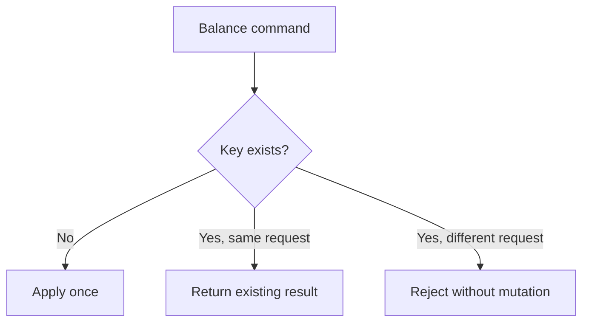

# Wallet Idempotency

Every credit or debit command requires an idempotency key.

## Key

The database unique key is:

```text
wallet_id + idempotency_key
```

## Replay

If a command uses the same key with the same semantic request, the existing ledger entry is returned as a replay and no second balance mutation occurs.

If the same key is reused with a different amount, direction, type, reference, or description, the operation is rejected as an idempotency conflict. No ledger row is inserted and the balance is unchanged.


