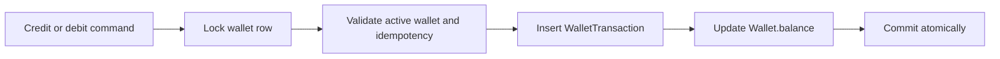

# Wallet Ledger

`wallet_transactions` is the immutable audit ledger for wallet balance changes.

## Rules

- Every posted balance change has one ledger row.
- Ledger rows are append-only from business flows.
- `balance_before` and `balance_after` are captured at posting time.
- Rejected debits and idempotency conflicts do not create ledger rows.
- Corrections must be represented by compensating entries in a later task, not by editing history.

## Constraints

PostgreSQL enforces non-negative balances, positive transaction amounts, one idempotency key per wallet, and credit/debit balance equations.
