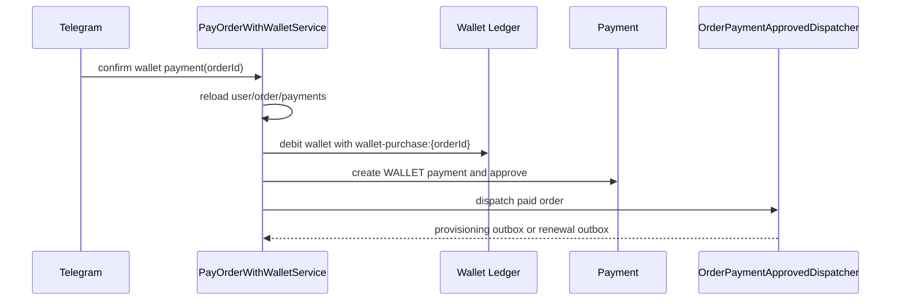

# Wallet Order Payment

Task 50 adds Wallet as an internal `PaymentMethod` for existing `ORDER` payment targets.

The trusted payable amount is always `orders.final_amount` and `orders.currency`.
Telegram callbacks never carry amount, balance, plan price, or currency.

`OrderType.NEW_SUBSCRIPTION` continues to queue the existing provisioning flow.
`OrderType.RENEWAL` continues to queue the existing renewal outbox flow.

Task 50 does not implement refunds, split payments, gift/referral/discount logic, or compensation after downstream failure.
