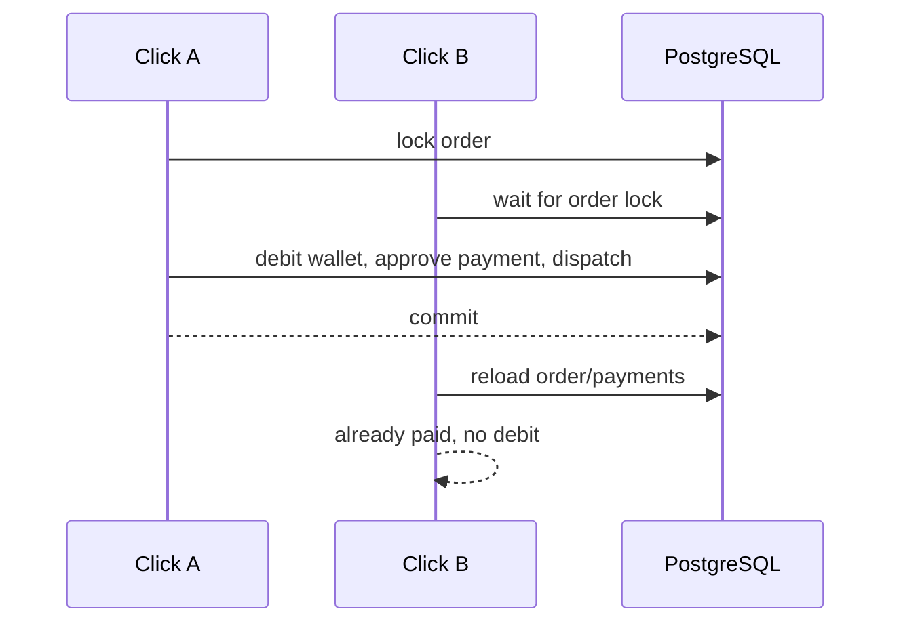

# Wallet Payment Concurrency

Wallet payment relies on database correctness, not JVM locks.

- The Order row is loaded with a write lock before payment.
- The Wallet row is loaded with a write lock by the existing debit use case.
- The ledger has a unique wallet/idempotency key constraint.
- Payments have a partial uniqueness rule for approved Order payments.
- Provisioning and renewal dispatch paths have their own unique outbox keys.

If wallet payment races with an active external payment, the wallet path rejects with a safe conflict result unless an approved payment already exists.
