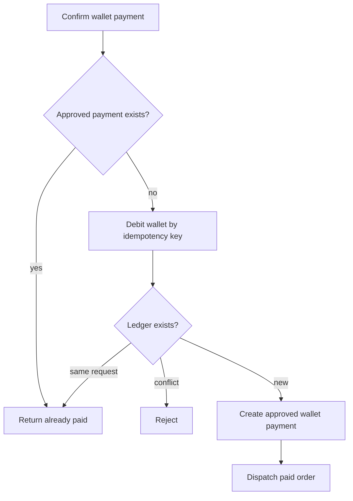

# Wallet Payment Idempotency

Wallet order payment uses layered idempotency:

- Wallet debit: `wallet-purchase:{orderId}` on `(wallet_id, idempotency_key)`.
- Payment: one approved `WALLET` payment per Order through the existing approved-payment uniqueness rule.
- Dispatch: existing provisioning and renewal outbox uniqueness.
- Telegram: signed, expiring, user-bound callback plus one-time sensitive confirmation.

Replays from Telegram retries, duplicate button clicks, app restart, or repeated dispatcher calls must not create a second debit or second downstream outbox.
