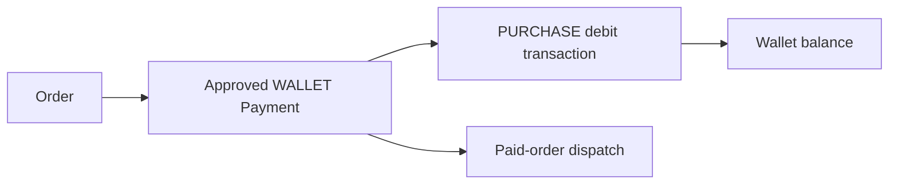

# Wallet Payment Reconciliation

Task 50 adds a read-only wallet order payment reconciliation use case.

It checks:

- an approved `WALLET` Payment exists;
- the Payment references a Wallet ledger transaction;
- the ledger transaction is a `PURCHASE` debit;
- the ledger reference is the Order id;
- amount, currency, and User match;
- the Order is in a paid/downstream state.

The use case does not auto-correct, refund, or compensate. Operators can use the result to investigate inconsistent fixtures or database corruption.
