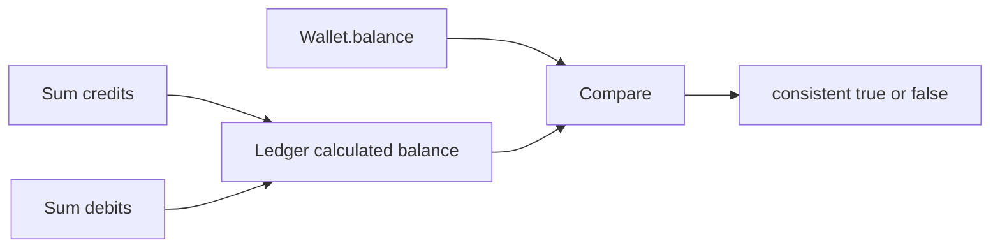

# Wallet Reconciliation

Task 48 adds read-only wallet reconciliation.

## Behavior

`ReconcileWalletBalanceUseCase` compares:

- stored `wallets.balance`;
- ledger-calculated balance from posted credits minus posted debits;
- transaction count.

It does not automatically repair mismatches. Operators should investigate and apply a future compensating adjustment workflow if needed.

