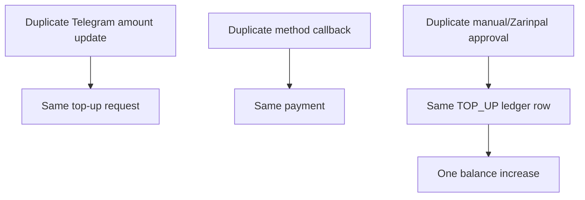

# Wallet Top-Up Idempotency

Task 49 uses layered idempotency:

- request creation: `user_id + wallet-top-up-request:{requestId}`;
- payment creation: one linked payment per top-up request;
- manual instruction/Zarinpal initialization: existing provider request IDs;
- approval credit: wallet ledger key `wallet-top-up:{topUpRequestId}`;
- ledger uniqueness: `wallet_id + idempotency_key`.

Conflicting idempotency-key reuse is rejected without mutating wallet balance.
