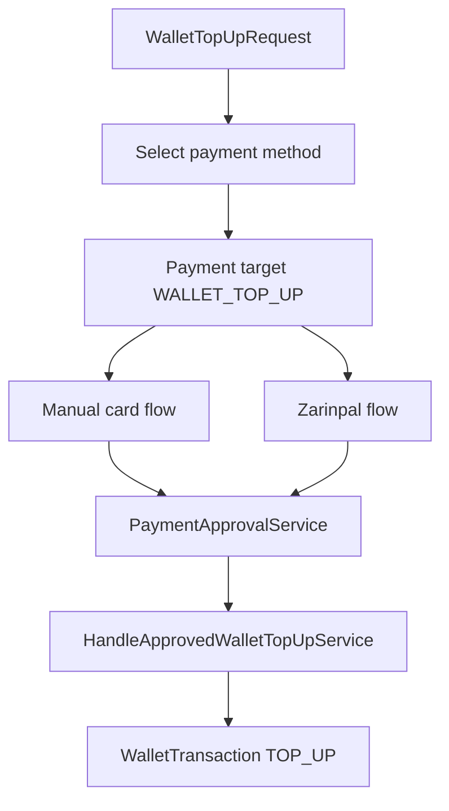

# Wallet Top-Up Payment Integration

Wallet top-up reuses the existing `Payment` model with a typed target:

- `ORDER` requires `order_id`.
- `WALLET_TOP_UP` requires `wallet_top_up_request_id`.

Manual card payment and Zarinpal both validate the typed target before provider initialization or receipt approval.

No fake `Order` is created for wallet top-up.
