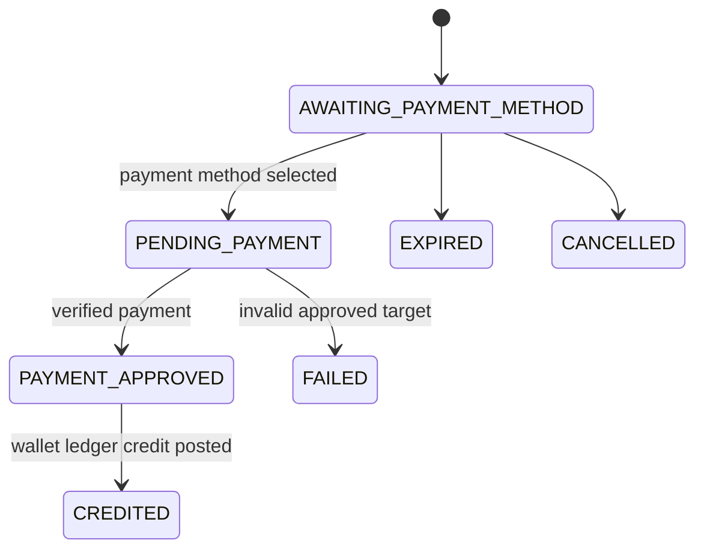

# Wallet Top-Up

Task 49 enables customer wallet top-up through existing payment methods.

## Lifecycle

The requested amount is immutable after request creation. Payment amount is always loaded from `WalletTopUpRequest.requestedAmount`, never from Telegram callback data or provider callbacks.

## Scope

Task 49 implements top-up only. It does not implement wallet purchases, refunds, gift codes, referrals, discounts, cashback, transfers, withdrawal, or Task 50 behavior.
