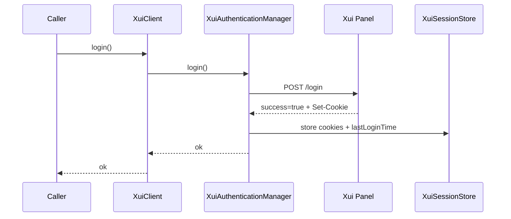
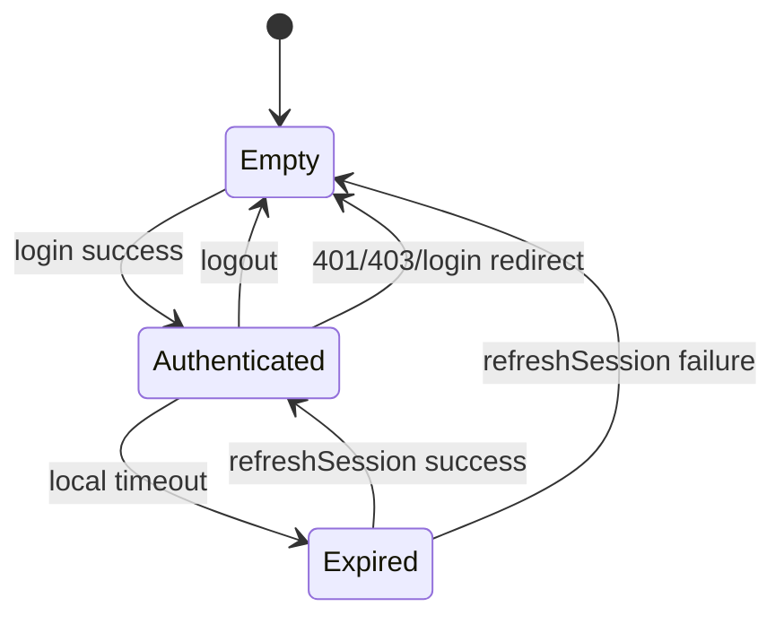
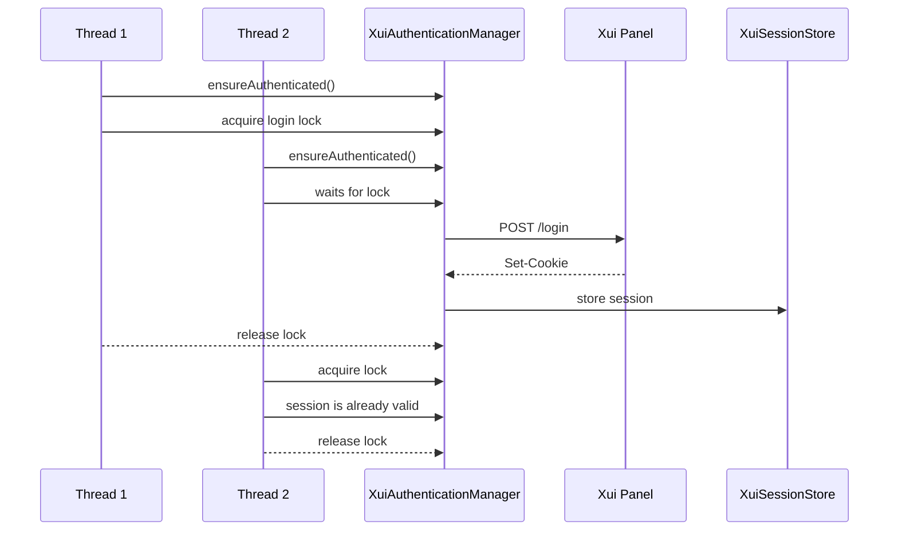
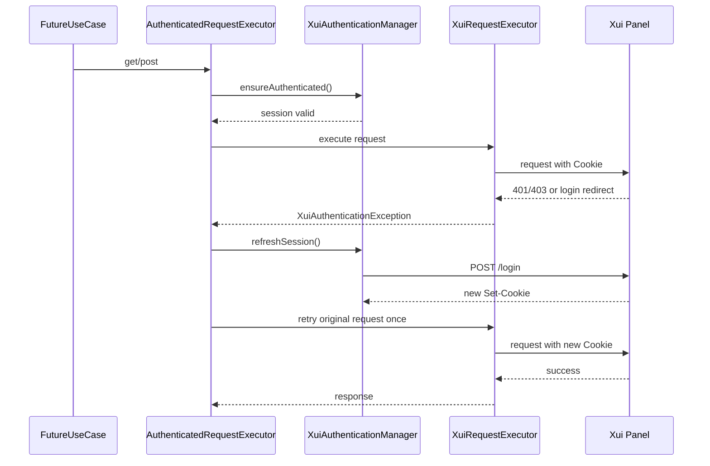

# Xui Authentication

## Purpose

Task 22 implements authentication and memory-only session management for the Xui HTTP client foundation. It does not implement inbound listing, client creation, client updates, client deletion, subscriptions, payments, Telegram flows, or VPN provisioning.

## Login Flow

`XuiAuthenticationManager` logs in by posting configured credentials to `/login`.

The login request uses:

- `XUI_USERNAME`
- `XUI_PASSWORD`
- `XUI_LOGIN_TIMEOUT`

Successful login requires:

- a successful JSON response with `success=true`;
- at least one `Set-Cookie` header.

All returned cookies are stored in `XuiSessionStore`. Cookie values are never exposed through the public port and are never logged.

## Session Lifecycle

Sessions are memory-only.

`XuiSessionStore` tracks:

- current cookies;
- whether a session is present;
- the last successful login time.

`XUI_SESSION_TIMEOUT` is a local defensive timeout. If configured, the client treats a session as expired after this duration from `lastLoginTime`. The panel may also expire the session independently. In that case the client detects expiry from HTTP `401`, HTTP `403`, or a redirect to a login URL.

No shutdown hook logs out automatically. `logout()` only clears local memory state.

## Authentication Manager

`XuiAuthenticationManager` owns:

- `login()`;
- `logout()`;
- `isAuthenticated()`;
- `refreshSession()`;
- `ensureAuthenticated()`.

`ensureAuthenticated()` is the method future Xui operations should call before making authenticated requests.

When `XUI_AUTO_LOGIN=true`, `ensureAuthenticated()` logs in automatically if no valid session exists.

When `XUI_AUTO_LOGIN=false`, `ensureAuthenticated()` fails unless `login()` was already called successfully.

## Thread Safety

Login is guarded with a `ReentrantLock`.

If many threads call `ensureAuthenticated()` at the same time while no valid session exists, only one thread performs the HTTP login. Other threads wait and then reuse the same stored cookies.

## Authenticated Request Flow

`AuthenticatedRequestExecutor` wraps low-level requests.

Flow:

1. Call `ensureAuthenticated()`.
2. Execute the request with stored cookies.
3. If the response indicates an expired session, clear cookies.
4. Login again once.
5. Retry the original request once.

There is no infinite authentication loop.

## Retry Interaction

Network retry and authentication retry are separate.

`XuiRetryExecutor` retries transient transport failures and selected gateway/unavailable statuses:

- timeout;
- connection failure;
- HTTP `502`;
- HTTP `503`;
- HTTP `504`.

It does not retry invalid credentials or authentication failures.

`AuthenticatedRequestExecutor` performs exactly one automatic re-login after an expired session. If the retried request is still unauthorized, the authentication exception is returned to the caller.

## Logging

Logged:

- login success;
- login failure;
- logout/local session clear;
- session refresh;
- automatic re-login;
- request method, sanitized URL, status, and duration.

Never logged:

- password;
- cookie values;
- authorization values;
- session identifiers;
- request bodies.

## Future Authenticated Requests

Future Xui operations should use `AuthenticatedRequestExecutor` rather than `XuiRequestExecutor` directly when they require a logged-in panel session.

Task 22 intentionally leaves these methods out of scope:

- inbound listing;
- client creation;
- client update;
- client deletion;
- subscription generation;
- VPN provisioning;
- payment or order workflows;
- Telegram workflows.
