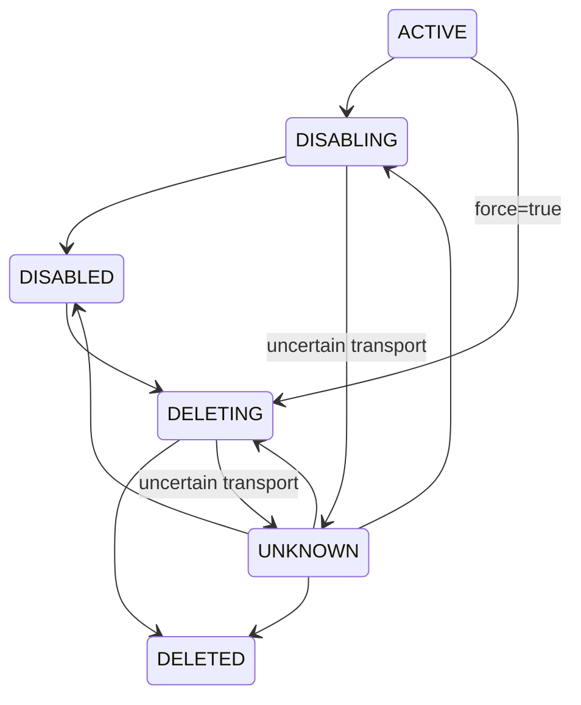
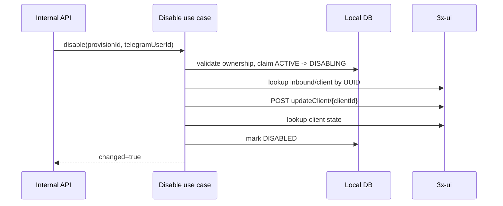
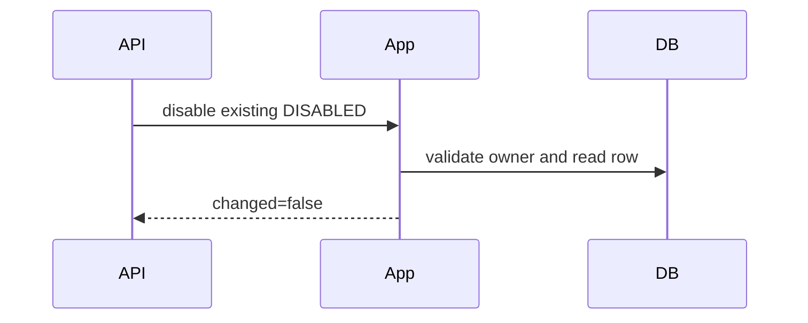
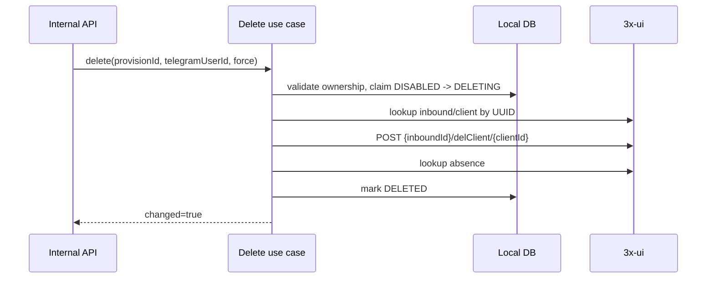
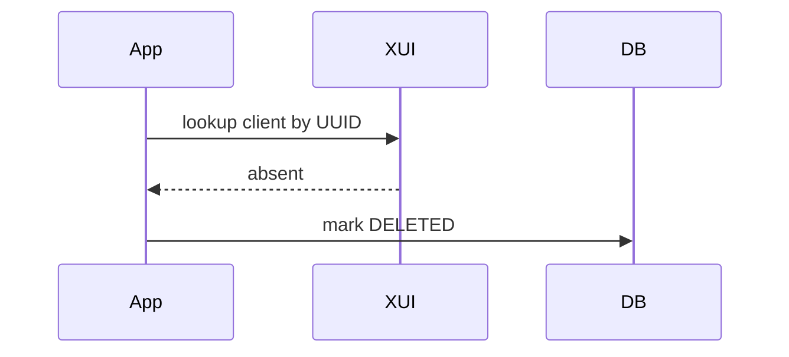
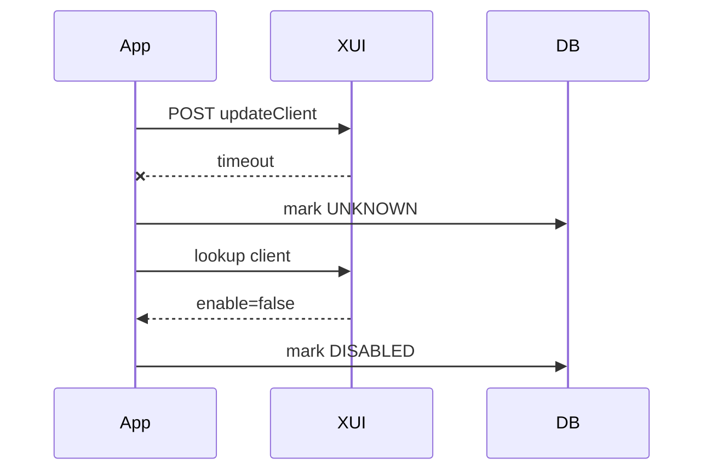
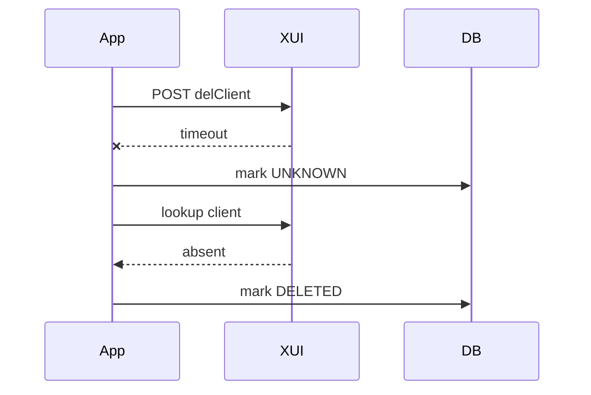

# 3x-ui Client Disable And Delete

Task 25 adds lifecycle operations for a previously provisioned 3x-ui client. It does not renew clients, update traffic, reset traffic, generate subscriptions, create QR codes, handle payments/orders, or call Telegram handlers.

## Verified Endpoints

The implementation uses configurable relative path templates:

```http
POST /panel/api/inbounds/updateClient/{clientId}
POST /panel/api/inbounds/{inboundId}/delClient/{clientId}
```

`clientId` is the Xray/3x-ui client UUID and is always the authoritative remote identity. Delete never uses email alone.

## Lifecycle

Task 25 extends `XuiProvisionStatus`:

- `DISABLING`: local operation has claimed a disable.
- `DISABLED`: remote client exists and `enable=false` is confirmed.
- `DELETING`: local operation has claimed permanent deletion.
- `DELETED`: remote client is confirmed absent or panel deletion succeeded.

The local `xui_client_provisions` row is retained permanently for audit history. Remote UUID, email, inbound ID, and timestamps are preserved after deletion.



## Disable Flow

Disable keeps the remote client but updates it to `enable=false`.



If the client is already disabled, local state converges to `DISABLED` and the response is idempotent.



Disable on a `DELETED` provision returns a conflict because there is no remote client left to disable.

## Delete Flow

Delete permanently removes the remote client and retains the local row as `DELETED`.



`ACTIVE` clients require `force=true` for direct deletion. Without force, delete returns conflict. Repeating delete on `DELETED` returns `changed=false` and does not require another remote request.

Already absent remote clients are treated as delete convergence:



## Identity Verification

Before disable/delete:

- lookup uses inbound ID and client UUID;
- UUID must match the local provision;
- email must match when present;
- mismatch raises a conflict and no destructive request is sent.

This prevents disabling or deleting a different remote client when labels drift.

## Transactions

No database transaction is held open during remote HTTP calls.

1. Short transaction validates user/provision ownership and claims `DISABLING` or `DELETING`.
2. Remote lookup/update/delete runs outside that transaction.
3. Short transaction marks `DISABLED`, `DELETED`, `FAILED`, or `UNKNOWN`.

## Uncertain Results

Disable timeout:



Delete timeout:



If lookup confirms the operation did not apply, one bounded retry may occur. If lookup remains inconclusive, the local row stays `UNKNOWN` and the API returns a safe `503`.

## Internal API

```http
POST /internal/xui/clients/{provisionId}/disable
DELETE /internal/xui/clients/{provisionId}
```

Disable request:

```json
{
  "telegramUserId": 123456789
}
```

Delete request:

```json
{
  "telegramUserId": 123456789,
  "force": false
}
```

Lifecycle responses expose only safe fields: provision ID, inbound ID, remote UUID, remote email, status, lifecycle timestamps, `changed`, and `remoteClientPresent`. They do not expose plan IDs, selection IDs, subscription IDs, raw panel messages, cookies, or failure details.

## Error Mapping

- Missing provision/user or ownership mismatch: `404`
- Invalid lifecycle transition: `409`
- Identity mismatch: `409`
- Confirmed remote rejection: `502`
- Uncertain lifecycle result: `503`
- Malformed request: `400`

All errors include `traceId` and never include cookies, credentials, subscription IDs, raw settings JSON, private keys, SQL details, or stack traces.

## Deferred Work

Task 26 may add re-enable/update/renewal behavior. Later tasks may add subscription delivery, QR code generation, traffic sync, reminders, payment/order workflows, and Telegram handlers.
