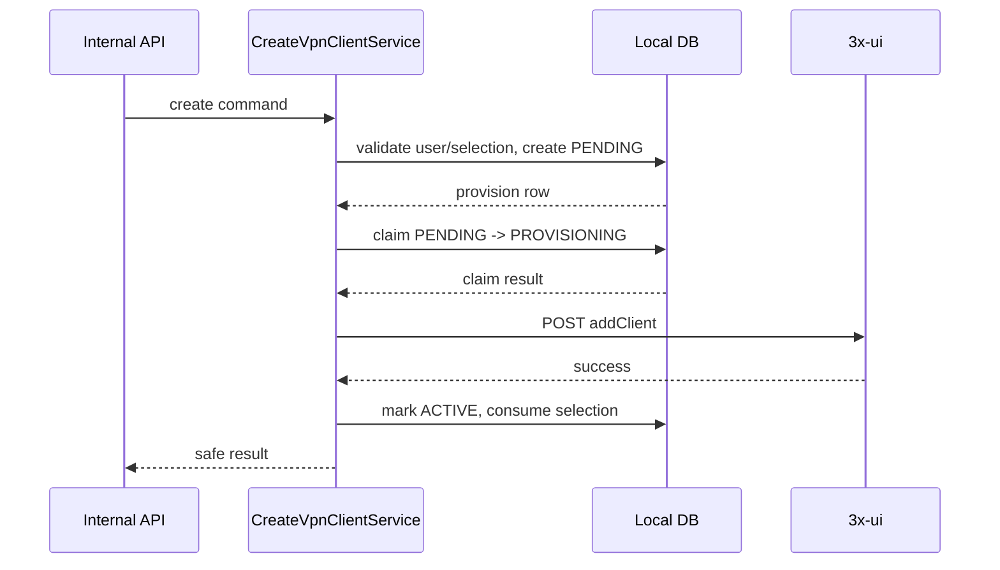
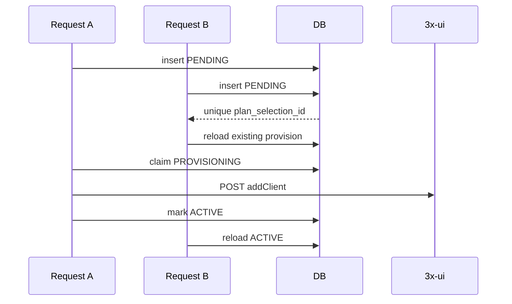
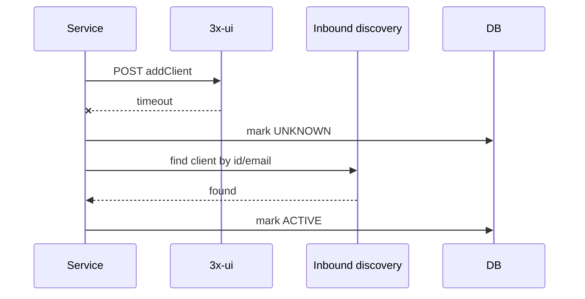

# 3x-ui Client Provisioning

Task 24 adds idempotent creation of a VLESS + REALITY client in an existing 3x-ui inbound. It does not generate VPN URIs, QR codes, payments, Telegram handlers, renewal, deletion, or traffic synchronization.

## API Assumption

The supported 3x-ui create-client endpoint is configurable and defaults to:

```http
POST /panel/api/inbounds/addClient
```

The request body follows the current 3x-ui panel convention:

```json
{
  "id": 7,
  "settings": {
    "clients": [
      {
        "id": "client-uuid",
        "flow": "xtls-rprx-vision",
        "email": "vpn_xxx_yyy",
        "limitIp": 1,
        "totalGB": 32212254720,
        "expiryTime": 1783766400000,
        "enable": true,
        "subId": "randomid"
      }
    ]
  }
}
```

The project keeps the path relative to `app.xui.base-url` through `app.xui.client-create-path`. No full server URL is hardcoded in application services.

## Local Aggregate

`XuiClientProvision` stores the local relationship between a user, a selected plan, an inbound, and the remote Xray/3x-ui client. It stores scalar IDs only and never stores cookies, panel credentials, raw request/response JSON, private keys, VPN URIs, or QR codes.

Statuses:

- `PENDING`: local row exists, no remote call in progress.
- `PROVISIONING`: this process claimed the row and may call 3x-ui.
- `ACTIVE`: remote client existence is confirmed.
- `FAILED`: remote operation definitely failed.
- `UNKNOWN`: transport result was uncertain and must be reconciled before retry.

`PlanSelection` is consumed only after the provision reaches `ACTIVE`. `FAILED` and `UNKNOWN` do not consume it.

## Identifier Strategy

- `remoteClientId`: random canonical UUID generated by `SecureXuiClientIdGenerator`.
- `remoteEmail`: deterministic, lowercase ASCII label from a short hash of user and provision identifiers, for example `vpn_abc123_def456`. It does not contain Telegram IDs or personal names.
- `remoteSubscriptionId`: URL-safe random identifier generated in memory and stored for later tasks, but it is not exposed by the verification API in Task 24.

## Trusted Values

The caller cannot provide remote UUID, email, traffic, expiry, IP limit, or flow. These values are derived from local state and configuration.

- Traffic uses bytes as the canonical unit. Unlimited local plans map to remote `totalGB=0`, which is the documented 3x-ui unlimited convention used by current examples.
- Expiry is calculated as provisioning time plus the selected plan duration snapshot.
- `maxDevicesSnapshot` maps to 3x-ui `limitIp` for Task 24. This is an approximation because device count and simultaneous source-IP limit are not always identical.
- Default flow comes from `app.xui-client-provisioning.default-flow` and defaults to `xtls-rprx-vision`.

## Transaction Boundaries

The workflow avoids a long database transaction around network I/O.



`PrepareXuiProvisionTransaction` performs validation and local row creation. `UpdateXuiProvisionStatusTransaction` claims, marks final status, and consumes the selection after confirmed success.

## Idempotency And Concurrency

Idempotency key: `planSelectionId`.

The database has unique constraints on `plan_selection_id`, `remote_client_id`, and `remote_email`. Concurrent requests recover by reloading the existing provision row. The status transition from non-active/non-provisioning to `PROVISIONING` is conditional, so only the caller that successfully claims the row sends the create request.



An existing `ACTIVE` provision returns `newlyCreated=false` and does not send another remote POST.

## Uncertain Results

Create-client POSTs are not blindly retried on timeout or interrupted connection. The result may already have been applied by 3x-ui.



If the client is confirmed absent, the service may perform one bounded retry using the same remote identifiers. If the client cannot be confirmed present or absent, the provision remains `UNKNOWN` and the API returns a safe `503`.

## Internal Verification API

```http
POST /internal/xui/clients
```

Request:

```json
{
  "telegramUserId": 123456789,
  "planSelectionId": "cccccccc-cccc-cccc-cccc-cccccccccccc",
  "inboundId": 7
}
```

`inboundId` is optional. If omitted, the service selects the lowest-ID eligible VLESS + REALITY inbound.

Response contains only safe fields: provision ID, plan IDs, inbound ID, remote client UUID, remote email, status, traffic, expiry, IP limit, provisioning time, and `newlyCreated`. It intentionally omits subscription ID, cookies, raw panel messages, client settings, and private keys.

## Error Mapping

- Invalid request: `400`
- Missing user/selection/inbound: existing not-found mappings
- Ineligible or invalid local state: `409`
- Confirmed create rejection: `502`
- Unknown or unreconciled create result: `503`
- Panel timeout: existing timeout mapping where propagated

All error responses use the standard error payload with `traceId` and no secrets.

## Lifecycle After Provisioning

Task 25 adds safe disable and permanent-delete operations for existing provisions. `ACTIVE` is no longer the only confirmed lifecycle state; a provision may later become `DISABLED` or `DELETED` while the local row remains retained for audit history.

## Deferred Work

Task 26 adds client re-enable, renewal, traffic-limit updates, traffic reset, and synchronization. Subscription URI generation, QR codes, payment/order integration, Telegram delivery, and lifecycle automation remain deferred.
