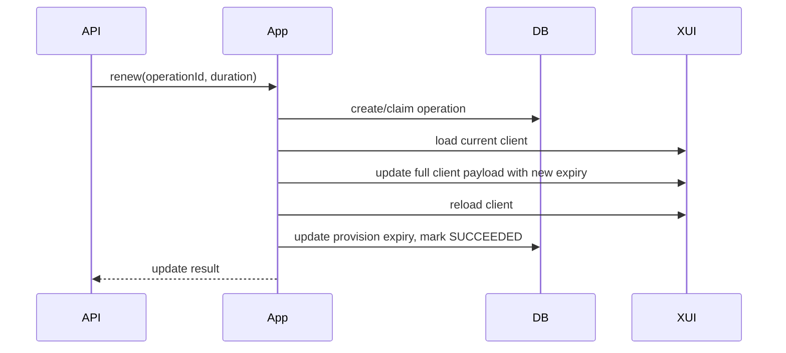
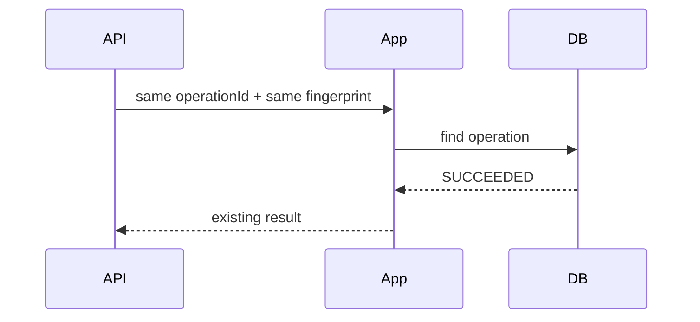
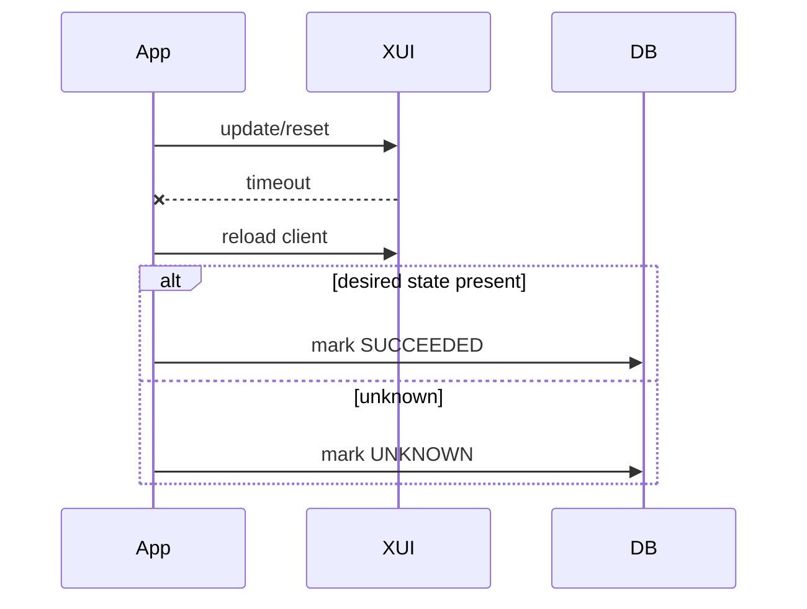

# 3x-ui Client Update, Renewal, Reset, and Synchronization

Task 26 completes Phase 4 client lifecycle support. It adds controlled update operations for an existing local `XuiClientProvision`; it does not add payment, order, Telegram handlers, subscription URI generation, QR codes, schedulers, or deployment behavior.

## Verified API Contracts

The project remains configured for the legacy/common 3x-ui inbounds client API used in Tasks 24 and 25:

- `POST /panel/api/inbounds/updateClient/{clientId}`
- payload: `{ "id": inboundId, "settings": "{\"clients\":[...]}" }`
- `totalGB` is bytes in the existing integration layer.
- `expiryTime` is epoch milliseconds.
- `totalGB=0` is treated as unlimited.

Current upstream 3x-ui also exposes newer client routes under `/panel/api/clients`, including:

- `POST /panel/api/clients/update/{email}`
- `POST /panel/api/clients/resetTraffic/{email}`
- `GET /panel/api/clients/traffic/{email}`
- `POST /panel/api/clients/clearIps/{email}`

Task 26 keeps endpoint paths configurable:

- `app.xui.client-update-path-template`
- `app.xui.client-reset-traffic-path-template`
- `app.xui.client-traffic-path-template`
- `app.xui.client-clear-ips-path-template`

## Update Payload Preservation

Updates use read-modify-write:

1. Load remote client by inbound ID and stable client UUID.
2. Verify the remote UUID and email against the local provision.
3. Copy current fields.
4. Patch only the requested values.
5. Submit the complete client payload.
6. Reload remote state and verify the intended change.

The update payload preserves UUID, email, flow, subscription ID, Telegram ID, comment, reset setting, expiry, traffic limit, enabled flag, and IP limit unless the operation explicitly changes one of them.

## Renewal

Two renewal modes exist:

- `EXTEND_FROM_CURRENT_EXPIRY`: future expiry is extended from current expiry; expired clients renew from now.
- `EXTEND_FROM_NOW`: expiry is always calculated from current provisioning time.

Renewal changes only expiry. It does not reset traffic, change traffic limit, or enable a disabled client.

## Traffic Limit Updates

Replace traffic limit sets the configured limit exactly. Add traffic uses the current configured remote limit plus a positive byte delta. Add traffic rejects unlimited clients because adding quota to unlimited has no useful meaning.

Configured limit and consumed traffic are distinct. Resetting traffic does not change the configured limit.

## Enable

Enable changes only the remote `enable` flag. ACTIVE clients are no-op idempotent successes. DELETED clients are rejected. Expired clients must be renewed explicitly before enable.

## IP Limit

`limitIp` is updated directly. `0` is treated as the panel convention for no IP limit. Changing the IP limit does not clear recorded IPs.

## Reset Traffic

Reset traffic uses the configured single-client reset endpoint by email. The service reads remote traffic first; if counters are already zero it returns a no-op success. After reset it reloads remote state and records known usage as zero locally.

## Operation Idempotency

Every update operation has a persisted `XuiClientOperation`:

- caller-provided `operationId`
- provision ID
- operation type
- deterministic SHA-256 request fingerprint
- status
- requested/completed timestamps
- sanitized failure fields

The operation ID is globally unique. Reusing it with the same fingerprint returns or reconciles the existing operation. Reusing it with different input is a conflict. This prevents duplicate renewals and duplicate additive traffic updates.

## Transaction Boundaries

The workflow uses three phases:

1. Local transaction: validate owner/provision, resolve idempotency, create/claim operation.
2. Remote phase: retrieve remote state, send update/reset, verify.
3. Local transaction: update provision and mark operation succeeded, failed, or unknown.

No database transaction is held open during remote HTTP calls.

## Concurrency

`xui_client_operations` has a partial unique index for one `IN_PROGRESS` operation per provision. Different concurrent operation IDs on the same provision are rejected while another operation is in progress. Same operation ID replays converge on the existing operation.

## Uncertain Results

Timeout and connection interruption are treated as uncertain. The workflow reloads remote state and compares exact requested values:

- expected state present: mark operation succeeded.
- old state present: bounded retry may be attempted by caller with the same operation.
- remote unavailable or mismatch: mark operation unknown and return a safe 503.

Add traffic never recalculates from a changed remote value after uncertainty.

## Synchronization

Synchronization loads the remote client and updates local expected config and observed counters:

- enabled/disabled status
- expiry
- configured traffic limit
- IP limit
- upload/download/total consumed bytes
- `lastSynchronizedAt`

Missing remote clients are not silently deleted locally.

## Internal API

All endpoints are internal verification endpoints under `/internal/xui/clients/{provisionId}`:

- `POST /renew`
- `PUT /traffic-limit`
- `POST /traffic/add`
- `POST /enable`
- `PUT /ip-limit`
- `POST /traffic/reset`
- `POST /synchronize`

Request bodies include `operationId` and `telegramUserId`. They never accept inbound ID, remote UUID, remote email, or subscription ID.

## Mermaid Diagrams

### Renewal

### Idempotent Replay

### Timeout Reconciliation

## Deferred Work

Phase 5 and later tasks may add payment/order integration, Telegram delivery, subscriptions, QR codes, scheduled renewals, traffic reminders, and administrative UI.
