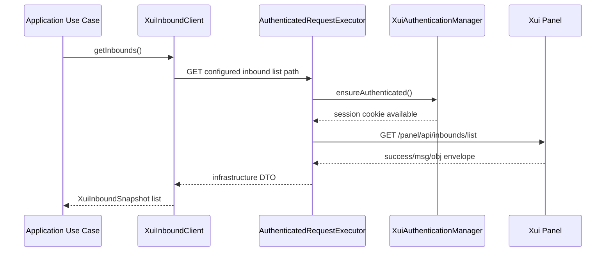
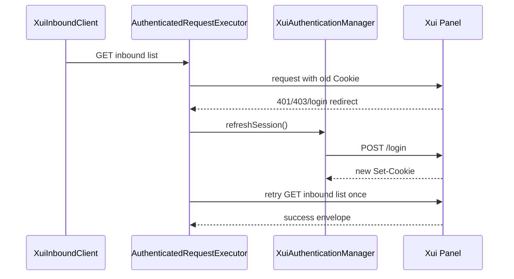
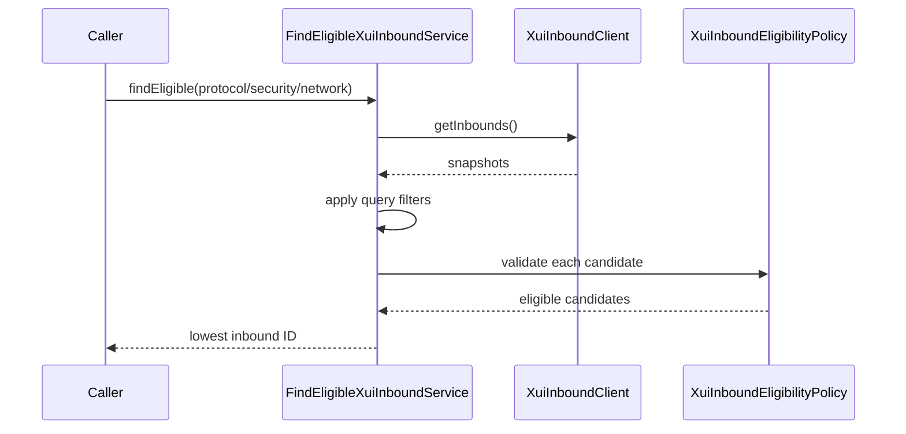
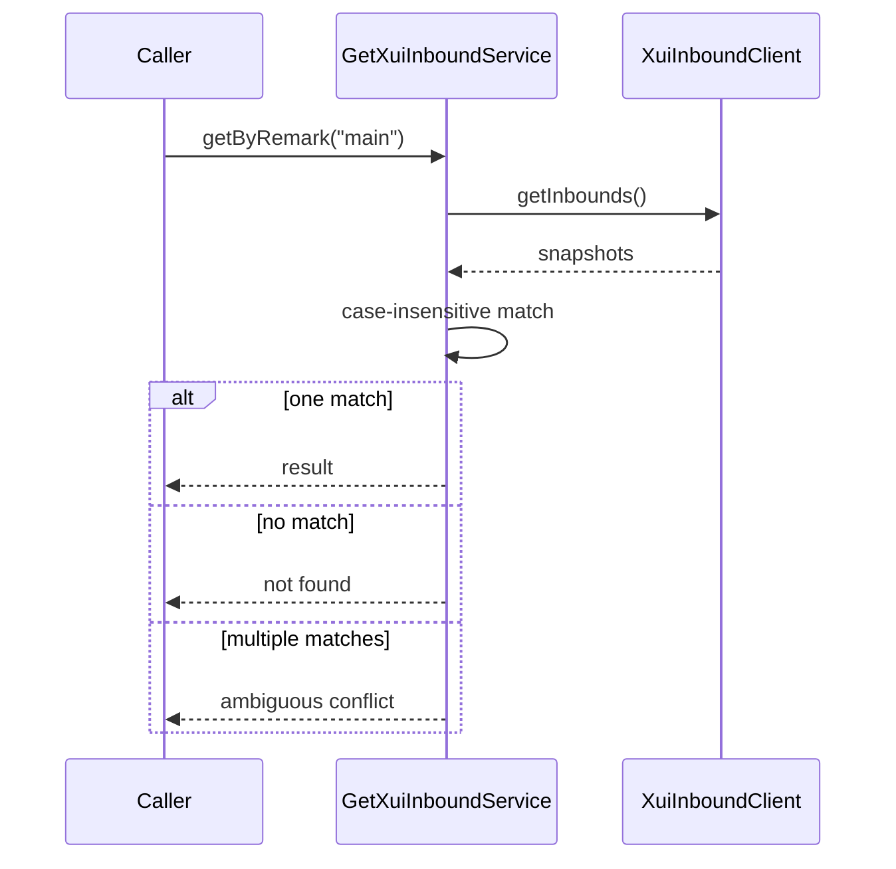

# Xui Inbound Discovery

## Purpose

Task 23 adds authenticated inbound discovery for the Xui panel.

It can:

- retrieve the configured inbound list endpoint;
- parse the response envelope;
- parse nested `settings` and `streamSettings` JSON strings;
- map remote data into application snapshots and results;
- find an inbound by ID;
- find an inbound by remark;
- select one deterministic eligible inbound for future client creation.

It does not create, update, or delete panel clients. It does not generate subscriptions, provision VPN accounts, create orders, create payments, or call Telegram handlers.

## Endpoint Assumption

The repository does not pin a specific Xui panel version. Current upstream panel API conventions expose the full inbound list at:

```text
GET /panel/api/inbounds/list
```

The path is configurable:

```yaml
app:
  xui:
    inbound-list-path: /panel/api/inbounds/list
```

Environment variable:

```text
XUI_INBOUND_LIST_PATH=/panel/api/inbounds/list
```

The path must be relative to `app.xui.base-url`. Full URLs are rejected so credentials and hosts stay centralized in Xui connection configuration.

## Authentication Reuse

Inbound retrieval uses `AuthenticatedRequestExecutor`.



If the panel returns `401`, `403`, or a login redirect, the session is cleared, a new login is attempted once, and the original request is retried once.



## Response Envelope

The expected remote envelope is:

```json
{
  "success": true,
  "msg": "",
  "obj": []
}
```

Rules:

- `success=false` becomes `XuiInvalidResponseException`.
- missing or empty `obj` for a successful list response returns an empty list.
- malformed JSON becomes `XuiInvalidResponseException`.
- HTTP auth failures remain `XuiAuthenticationException`.
- HTTP connection and timeout failures remain gateway-style Xui exceptions.

Raw remote DTOs remain in `infrastructure.xui.dto.inbound`.

## Nested Settings Parsing

Xui inbound rows commonly store `settings` and `streamSettings` as JSON-encoded strings. Parsing is isolated in `XuiInboundPayloadParser` and uses Jackson `JsonNode`.

Parsed from `settings`:

- client ID;
- email;
- enabled flag;
- traffic bytes;
- expiry epoch milliseconds;
- IP limit;
- subscription ID.

Parsed from `streamSettings`:

- stream network;
- security type;
- REALITY server name;
- REALITY public key;
- first short ID.

Private keys are ignored and are not included in application results, API responses, logs, or fixtures.

## Protocols

Task 23 validates and normalizes inbound protocol names to uppercase. VLESS discovery is required and covered. Other protocols such as VMESS and TLS stream settings are tolerated for listing, but the default eligibility policy currently selects only VLESS + REALITY inbounds.

No VPN URI generation is implemented.

## Time And Traffic

Traffic is kept in bytes as `long`.

Expiry values are interpreted as epoch milliseconds:

- positive values become `Instant`;
- zero or negative values mean no expiry and map to `null`.

The client layer does not convert bytes to GB and does not calculate remaining traffic.

## Eligibility

`XuiInboundEligibilityPolicy` requires:

- `enabled=true`;
- `protocol=VLESS`;
- `securityType=REALITY`;
- port between `1` and `65535`;
- public key present;
- short ID present;
- server name present.

`FindEligibleXuiInboundService` applies optional query filters and then chooses the eligible inbound with the lowest inbound ID. Selection is deterministic and is not persisted in Task 23.



## Lookup By Remark

Remark lookup is case-insensitive.



Duplicate remarks are not silently resolved. Use ID lookup when remarks are ambiguous.

## Internal Verification API

Temporary internal endpoints:

- `GET /internal/xui/inbounds`
- `GET /internal/xui/inbounds/{inboundId}`
- `GET /internal/xui/inbounds/by-remark/{remark}`
- `GET /internal/xui/inbounds/eligible?protocol=&security=&network=`

Responses expose:

- inbound ID;
- remark;
- protocol;
- port;
- enabled flag;
- listen address;
- traffic byte totals;
- expiry time;
- client count;
- stream network;
- security type;
- server name;
- public key;
- short IDs.

Responses do not expose:

- raw clients;
- client emails or UUIDs;
- raw `settings`;
- raw `streamSettings`;
- private keys;
- cookies;
- credentials;
- session IDs.

## Exception Mapping

- inbound not found -> `404`
- no eligible inbound -> `404`
- ambiguous remark -> `409`
- invalid remote response -> `502`
- remote panel auth/client/server failure -> `502`
- panel unavailable -> `503`
- panel timeout -> `504`

All API errors use the standard error response with `traceId`.

## Logging

Safe logging includes request starts/completions, inbound count, and selected eligible inbound ID.

Never log credentials, cookies, session IDs, private keys, full nested settings JSON, client identifiers in bulk, or subscription IDs.

## Task 24 Usage

Task 24 reuses inbound discovery to validate explicit inbound IDs and to select the lowest-ID eligible inbound when no inbound is supplied. It also adds a focused `findClient(inboundId, clientId, email)` lookup for timeout reconciliation after create-client requests.

## Deferred Work

Later tasks may add subscription generation, client update/delete, order/payment integration, Telegram-facing flows, and production authentication for internal verification endpoints.
